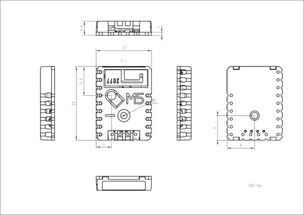
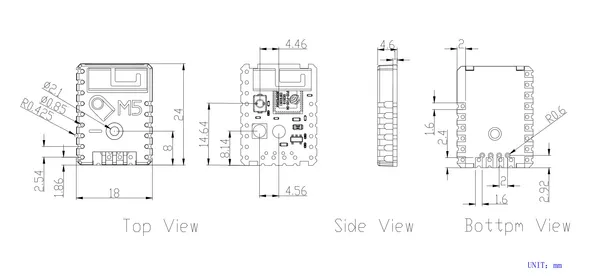

# Stamp-Pico

**M5Stack** · ESP32 original

Revision: Not identified  
Coverage: Pinout image collected

[Browse all manufacturers](../../../../BROWSE.md) · [Desktop app](https://github.com/valleytechsolutions/black-wire-desktop)

## Pinout

**pinout image** · Reviewed source · PNG

[Open original reference](../../../../library/media/e105afee2022b08e7d867779965b32fb78e09b8cba3d53f594e23ba8b2dc593f.png)

**Credit and rights:** Not established; source attribution retained. Source/manufacturer: M5Stack.

[Source 1](https://static-cdn.m5stack.com/resource/docs/products/core/stamp_pico/stamp_pico_12.webp) · [Source 2](https://docs.m5stack.com/en/core/stamp_pico)

Imported from existing M5Stack Board Reference; original working path preserved.

SHA-256: `e105afee2022b08e7d867779965b32fb78e09b8cba3d53f594e23ba8b2dc593f`

## Dimensions

**source reference** · Unreviewed source · JPG

[Open original reference](../../../../library/media/0ada4de57fa408aa9589bc7ad1cfa855442ef9717595f299d5fe516505c23664.jpg)

**Credit and rights:** Source rights not yet established. Source/manufacturer: M5Stack.

[Source 1](https://m5stack.oss-cn-shenzhen.aliyuncs.com/resource/docs/products/core/stamp_pico/model%20size.jpg) · [Source 2](https://docs.m5stack.com/en/core/stamp_pico)

Original source index: Dimensions. This file is searchable but has not been promoted to a reviewed physical board pinout.

SHA-256: `0ada4de57fa408aa9589bc7ad1cfa855442ef9717595f299d5fe516505c23664`

## Dimensions

**source reference** · Unreviewed source · PNG

[Open original reference](../../../../library/media/071d366650d1e6f1516838fccda8d89bb948e5847463ed94988e3b601ab05632.png)

**Credit and rights:** Source rights not yet established. Source/manufacturer: M5Stack.

[Source 1](https://static-cdn.m5stack.com/resource/docs/products/core/stamp_pico/stamp_pico_size_01.webp) · [Source 2](https://docs.m5stack.com/en/core/stamp_pico)

Original source index: Dimensions. This file is searchable but has not been promoted to a reviewed physical board pinout.

SHA-256: `071d366650d1e6f1516838fccda8d89bb948e5847463ed94988e3b601ab05632`

Pin assignments have not been independently electrically verified. Check board revision before wiring.
