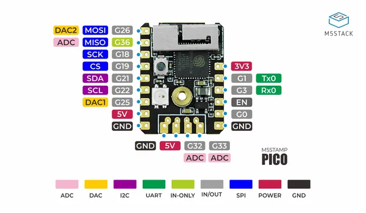

# Stamp-Pico Mate

**M5Stack** · ESP32 original

Revision: Not identified  
Coverage: Pinout image collected

[Browse all manufacturers](../../../../BROWSE.md) · [Desktop app](https://github.com/valleytechsolutions/black-wire-desktop)

## Pinout

**pinout image** · Reviewed source · PNG

[Open original reference](../../../../library/media/e105afee2022b08e7d867779965b32fb78e09b8cba3d53f594e23ba8b2dc593f.png)

**Credit and rights:** Not established; source attribution retained. Source/manufacturer: M5Stack.

[Source 1](https://static-cdn.m5stack.com/resource/docs/products/core/stamp_pico/stamp_pico_12.webp) · [Source 2](https://docs.m5stack.com/en/core/stamp_pico_mate)

Imported from existing M5Stack Board Reference; original working path preserved.

SHA-256: `e105afee2022b08e7d867779965b32fb78e09b8cba3d53f594e23ba8b2dc593f`

Pin assignments have not been independently electrically verified. Check board revision before wiring.
