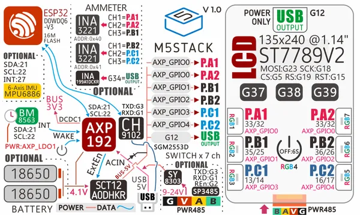
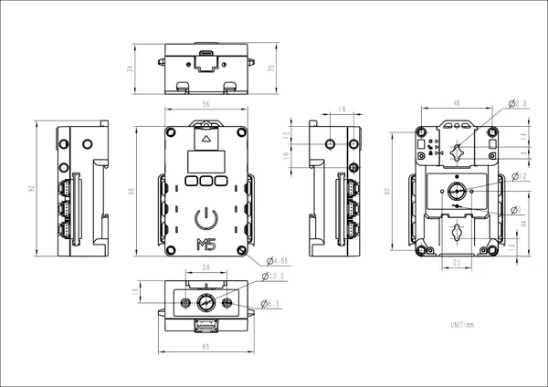

# Station-Bat

**M5Stack** · ESP32 original

Revision: Not identified  
Coverage: Pinout image collected

[Browse all manufacturers](../../../../BROWSE.md) · [Desktop app](https://github.com/valleytechsolutions/black-wire-desktop)

## Pinout

**pinout image** · Reviewed source · JPG

[Open original reference](../../../../library/media/3fbfeecc25cae5c681b58fe342d6815aaac74ce99df60c8222c5dae9208d827a.jpg)

**Credit and rights:** Not established; source attribution retained. Source/manufacturer: M5Stack.

[Source 1](https://m5stack-doc.oss-cn-shenzhen.aliyuncs.com/521/K124-BK123.jpg) · [Source 2](https://docs.m5stack.com/en/core/station_bat)

Imported from existing M5Stack Board Reference; original working path preserved.

SHA-256: `3fbfeecc25cae5c681b58fe342d6815aaac74ce99df60c8222c5dae9208d827a`

## Dimensions

**source reference** · Unreviewed source · JPG

[Open original reference](../../../../library/media/ee378c8da9ec01dd4ef1bb3835521e2327236a5c075e89a17fcc9cc39af5ba61.jpg)

**Credit and rights:** Source rights not yet established. Source/manufacturer: M5Stack.

[Source 1](https://m5stack.oss-cn-shenzhen.aliyuncs.com/resource/docs/products/core/station_bat/module%20size.jpg) · [Source 2](https://docs.m5stack.com/en/core/station_bat)

Original source index: Dimensions. This file is searchable but has not been promoted to a reviewed physical board pinout.

SHA-256: `ee378c8da9ec01dd4ef1bb3835521e2327236a5c075e89a17fcc9cc39af5ba61`

Pin assignments have not been independently electrically verified. Check board revision before wiring.
