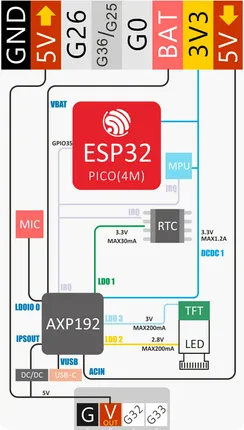
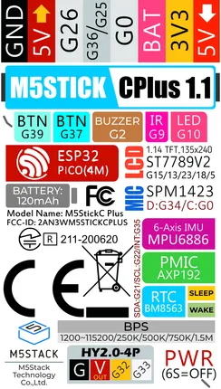

# StickC-Plus

**M5Stack** · ESP32 original

Revision: Multiple source/revision records; see individual assets  
Coverage: Pinout image collected

[Browse all manufacturers](../../../../BROWSE.md) · [Devices & IoT](../../../../DEVICES.md) · [Open in the browser guide](https://valleytech-black-wire-guide.pages.dev/?board=m5stack-gpio-device-stickc-plus)

Device category: **Controllers & instruments**

## Pinout

**pinout image** · Reviewed source · PNG

[Open original reference](../../../../library/media/7fef8372ff885e0e5a2bb37338d5b7c5465c7cfced0b75e14ef5ed8ee530786d.png)

**Credit and rights:** Not established; source attribution retained. Source/manufacturer: M5Stack.

[Source 1](https://static-cdn.m5stack.com/resource/docs/products/core/m5stickc_plus/m5stickc_plus_sch_02.webp) · [Source 2](https://docs.m5stack.com/en/core/m5stickc_plus)

Imported from existing M5Stack Board Reference; original working path preserved.

Image revision: Not identified

SHA-256: `7fef8372ff885e0e5a2bb37338d5b7c5465c7cfced0b75e14ef5ed8ee530786d`

## Pinout

**pinout image** · Reviewed source · PNG

[Open original reference](../../../../library/media/a057b44bd30c234e522e9d8614967fd584e30ef207c56fb00c16d8e852bf8f81.png)

**Credit and rights:** Not established; source attribution retained. Source/manufacturer: M5Stack.

[Source 1](https://static-cdn.m5stack.com/resource/docs/products/core/m5stickc_plus/m5stickc_plus_sch_01.webp) · [Source 2](https://docs.m5stack.com/en/core/m5stickc_plus)

Imported from existing M5Stack Board Reference; original working path preserved.

Image revision: v1.1 printed on label

SHA-256: `a057b44bd30c234e522e9d8614967fd584e30ef207c56fb00c16d8e852bf8f81`

Pin assignments have not been independently electrically verified. Check board revision before wiring.
