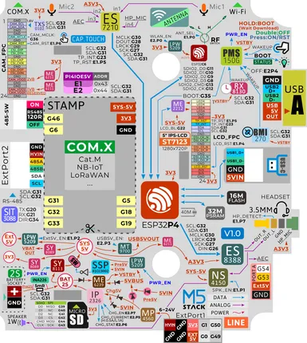

# M5Stack Tab5 IoT Development Kit

**M5Stack** · ESP32-P4

Revision: Not identified  
Coverage: Pinout image collected

[Browse all manufacturers](../../../../BROWSE.md) · [Devices & IoT](../../../../DEVICES.md) · [Open in the browser guide](https://valleytech-black-wire-guide.pages.dev/?board=m5stack-esp32-tab5-iot-development-kit)

Device category: **Displays & HMI**

## Physical board pinout

**pinout image** · Reviewed source · PNG

[Open original reference](../../../../library/media/82ef49b176e53bf2cbd062cde416684d358e038f2486824c1d31618df197ea85.png)

**Credit and rights:** Not established; source attribution retained. Source/manufacturer: M5Stack.

[Source 1](https://m5stack-doc.oss-cn-shenzhen.aliyuncs.com/1132/C145_Pinmap_Overview.png) · [Source 2](https://docs.m5stack.com/en/core/Tab5)

Discovered from CircuitPython board metadata and the linked product/documentation page. Exact hardware revision requires matching to the diagram.

Image revision: Not identified

SHA-256: `82ef49b176e53bf2cbd062cde416684d358e038f2486824c1d31618df197ea85`

Pin assignments have not been independently electrically verified. Check board revision before wiring.
