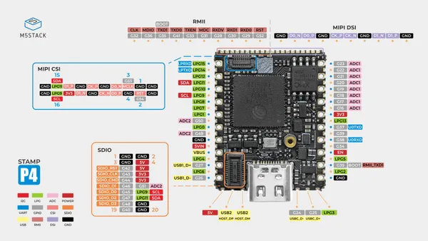
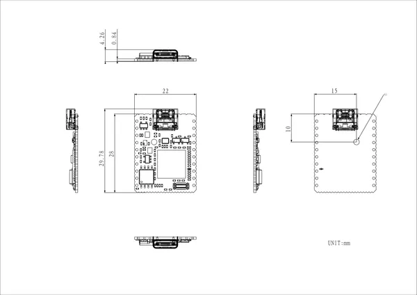

# Stamp-P4

**M5Stack** · ESP32-P4

Revision: Not identified  
Coverage: Pinout image collected

[Browse all manufacturers](../../../../BROWSE.md) · [Desktop app](https://github.com/valleytechsolutions/black-wire-desktop)

## Pinout

**pinout image** · Reviewed source · JPG

[Open original reference](../../../../library/media/d3277fd38e4493d6133069e728558a35fd6df98b735179c7e6fef03c29588781.jpg)

**Credit and rights:** Not established; source attribution retained. Source/manufacturer: M5Stack.

[Source 1](https://m5stack-doc.oss-cn-shenzhen.aliyuncs.com/1218/S013-stamp-p4-pinmap.jpg) · [Source 2](https://docs.m5stack.com/en/core/Stamp-P4)

Imported from existing M5Stack Board Reference; original working path preserved.

SHA-256: `d3277fd38e4493d6133069e728558a35fd6df98b735179c7e6fef03c29588781`

## Dimensions

**source reference** · Unreviewed source · PNG

[Open original reference](../../../../library/media/c8a16fbd8a7ceaa35f24fdce860ab27ffcf2cc8c9c595abacdd72e232095317c.png)

**Credit and rights:** Source rights not yet established. Source/manufacturer: M5Stack.

[Source 1](https://m5stack-doc.oss-cn-shenzhen.aliyuncs.com/1218/S013-model-size-stampp4_page_01.png) · [Source 2](https://docs.m5stack.com/en/core/Stamp-P4)

Original source index: Dimensions. This file is searchable but has not been promoted to a reviewed physical board pinout.

SHA-256: `c8a16fbd8a7ceaa35f24fdce860ab27ffcf2cc8c9c595abacdd72e232095317c`

Pin assignments have not been independently electrically verified. Check board revision before wiring.
