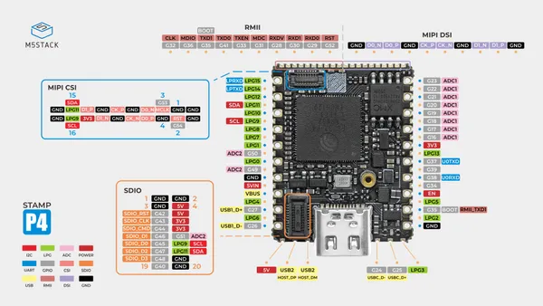
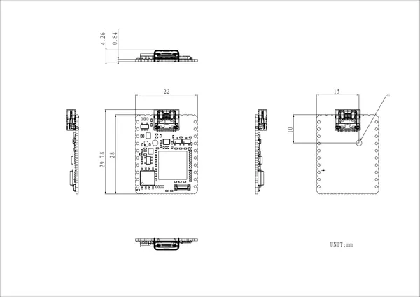
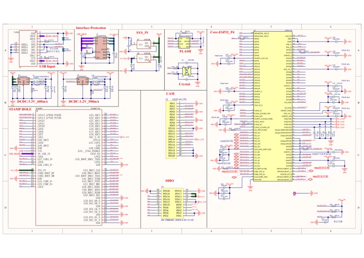

# Stamp-P4

**M5Stack** · ESP32-P4

Revision: Not identified

Coverage: Manufacturer references reviewed by scope; independent electrical and all-connector review pending

[Browse all manufacturers](../../../../BROWSE.md) · [Devices & IoT](../../../../DEVICES.md) · [Open in the browser guide](https://valleytech-black-wire-guide.pages.dev/?board=m5stack-esp32-stamp-p4)

## Datasheets and original documentation

Board datasheet: **not yet recorded**. Visual reference: **available**.

[Manufacturer hardware documentation](https://docs.m5stack.com/en/core/Stamp-P4)

- **schematic / board**: [Stamp-P4 Schematics PDF](https://m5stack-doc.oss-cn-shenzhen.aliyuncs.com/1218/SCH_Stamp-P4_2026_03_16_17_23_06.pdf) · [saved document](../../../../library/media/896d1560b734f310e9f33578337aec0a9534f19aaccd22f1054930fabda15b63.pdf)
- **hardware-guide / board**: [Manufacturer pin and hardware documentation](https://docs.m5stack.com/en/core/Stamp-P4) · online

A chip datasheet, schematic and board datasheet have different scopes. Match the exact hardware revision.

[Documentation coverage and remaining gaps](../../../../DOCUMENTATION.md)

## Pinout

**pinout image** · Reviewed source · JPG

[Open original reference](../../../../library/media/d3277fd38e4493d6133069e728558a35fd6df98b735179c7e6fef03c29588781.jpg)

**Credit and rights:** Not established; source attribution retained. Source/manufacturer: M5Stack.

[Source 1](https://m5stack-doc.oss-cn-shenzhen.aliyuncs.com/1218/S013-stamp-p4-pinmap.jpg) · [Source 2](https://docs.m5stack.com/en/core/Stamp-P4)

Imported from existing M5Stack Board Reference; original working path preserved.

Image revision: Not identified

SHA-256: `d3277fd38e4493d6133069e728558a35fd6df98b735179c7e6fef03c29588781`

## Dimensions

**source reference** · Unreviewed source · PNG

[Open original reference](../../../../library/media/c8a16fbd8a7ceaa35f24fdce860ab27ffcf2cc8c9c595abacdd72e232095317c.png)

**Credit and rights:** Source rights not yet established. Source/manufacturer: M5Stack.

[Source 1](https://m5stack-doc.oss-cn-shenzhen.aliyuncs.com/1218/S013-model-size-stampp4_page_01.png) · [Source 2](https://docs.m5stack.com/en/core/Stamp-P4)

Original source index: Dimensions. This file is searchable but has not been promoted to a reviewed physical board pinout.

Image revision: Not identified

SHA-256: `c8a16fbd8a7ceaa35f24fdce860ab27ffcf2cc8c9c595abacdd72e232095317c`

## Stamp-P4 Schematics PDF

**original reference PDF** · Manufacturer source and first-page preview inspected; independent electrical and all-connector completeness review pending. · PDF

[Open original reference](../../../../library/media/896d1560b734f310e9f33578337aec0a9534f19aaccd22f1054930fabda15b63.pdf)

**Credit and rights:** Manufacturer artwork; reuse and print rights not established. Inclusion does not relicense the original.. Source/manufacturer: M5Stack.

[Source 1](https://m5stack-doc.oss-cn-shenzhen.aliyuncs.com/1218/SCH_Stamp-P4_2026_03_16_17_23_06.pdf) · [Source 2](https://docs.m5stack.com/en/core/Stamp-P4)

Manufacturer source retained unchanged. Manufacturer source and first-page preview inspected; independent electrical and all-connector completeness review pending.

Image revision: As supplied in the original; match exact board revision

SHA-256: `896d1560b734f310e9f33578337aec0a9534f19aaccd22f1054930fabda15b63`

Pin assignments have not been independently electrically verified. Check board revision before wiring.
