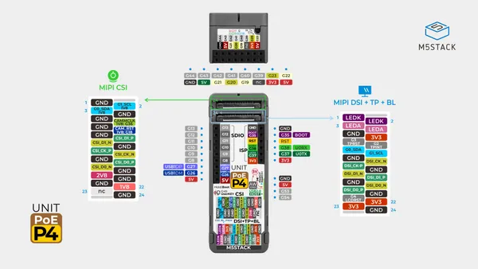
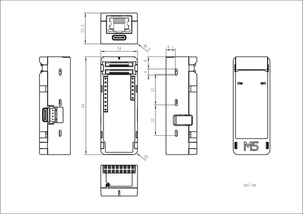

# Unit PoE-P4

**M5Stack** · ESP32-P4

Revision: Not identified  
Coverage: Pinout image collected

[Browse all manufacturers](../../../../BROWSE.md) · [Devices & IoT](../../../../DEVICES.md) · [Open in the browser guide](https://valleytech-black-wire-guide.pages.dev/?board=m5stack-gpio-device-unit-poe-p4)

Device category: **Controllers & instruments**

## Pinout

**pinout image** · Reviewed source · JPG

[Open original reference](../../../../library/media/aff720562d8894d2ce803f23736e138b432664b008ea17541b4828b1b585ef71.jpg)

**Credit and rights:** Not established; source attribution retained. Source/manufacturer: M5Stack.

[Source 1](https://m5stack-doc.oss-cn-shenzhen.aliyuncs.com/1217/U213_PinMap_01.jpg) · [Source 2](https://docs.m5stack.com/en/unit/Unit_PoE-P4)

Imported from existing M5Stack Board Reference; original working path preserved.

Image revision: Not identified

SHA-256: `aff720562d8894d2ce803f23736e138b432664b008ea17541b4828b1b585ef71`

## Dimensions

**source reference** · Unreviewed source · PNG

[Open original reference](../../../../library/media/eaa4f71aae2fa6a215ccb3ce1ac351152810fee09ddfeecb025c80e11b5b5dcc.png)

**Credit and rights:** Source rights not yet established. Source/manufacturer: M5Stack.

[Source 1](https://m5stack-doc.oss-cn-shenzhen.aliyuncs.com/1217/U213-unit-poe-p4-model-size_page_01.png) · [Source 2](https://docs.m5stack.com/en/unit/Unit_PoE-P4)

Original source index: Dimensions. This file is searchable but has not been promoted to a reviewed physical board pinout.

Image revision: Not identified

SHA-256: `eaa4f71aae2fa6a215ccb3ce1ac351152810fee09ddfeecb025c80e11b5b5dcc`

Pin assignments have not been independently electrically verified. Check board revision before wiring.
