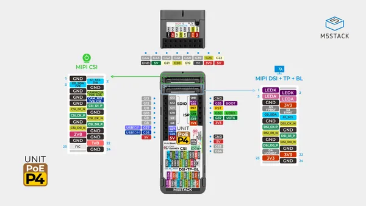
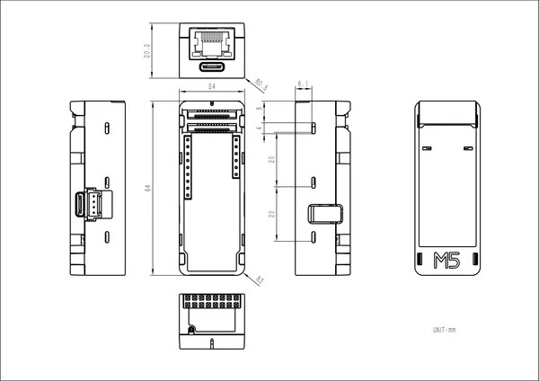
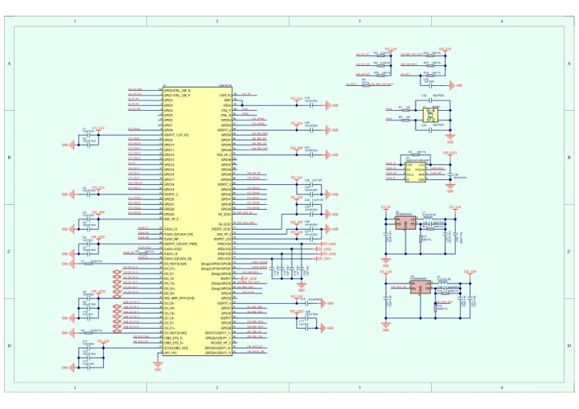
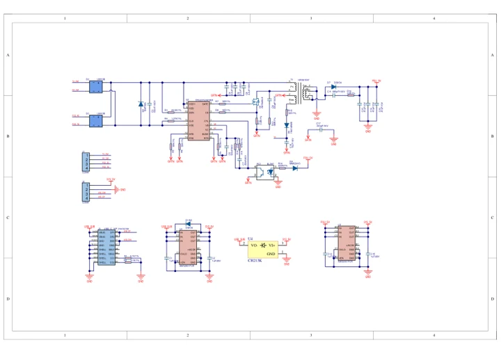
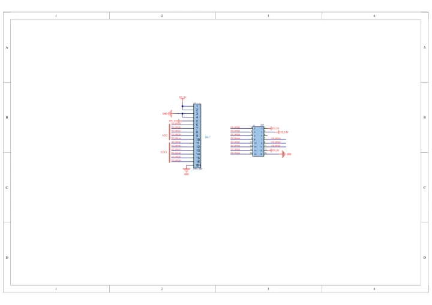

# Unit PoE-P4

**M5Stack** · ESP32-P4

Revision: Not identified

Coverage: Manufacturer references reviewed by scope; independent electrical and all-connector review pending

[Browse all manufacturers](../../../../BROWSE.md) · [Devices & IoT](../../../../DEVICES.md) · [Open in the browser guide](https://valleytech-black-wire-guide.pages.dev/?board=m5stack-gpio-device-unit-poe-p4)

Device category: **Controllers & instruments**

## Datasheets and original documentation

Board datasheet: **not yet recorded**. Visual reference: **available**.

[Manufacturer hardware documentation](https://docs.m5stack.com/en/unit/Unit_PoE-P4)

- **schematic / board**: [Unit PoE-P4 Mainboard Schematics PDF](https://m5stack-doc.oss-cn-shenzhen.aliyuncs.com/1217/SCH_StickPoE_SCH_Main_V0.2_20250829_2026_02_02_17_17_04.pdf) · [saved document](../../../../library/media/8752b415bceb61bc8f1f53d487bed0e67ce0125e06ded5350f1b8016dc8d0692.pdf)
- **schematic / board**: [Unit PoE-P4 Power Board Schematics PDF](https://m5stack-doc.oss-cn-shenzhen.aliyuncs.com/1217/SCH_StickPoE_SCH_POWER_V0.2_20250731_2026_02_02_17_17_39.pdf) · [saved document](../../../../library/media/20df3deef133f05ec4ed8d83fb7ca534219c2113fa7acf521032a9ab95e7c471.pdf)
- **schematic / board**: [Unit PoE-P4 HAT Expansion Interface Schematics PDF](https://m5stack-doc.oss-cn-shenzhen.aliyuncs.com/1217/SCH_StickPoE_SCH_Hat_V0.2_20250801_2026_02_02_17_16_35.pdf) · [saved document](../../../../library/media/ad513ecaf80b025a34b7c718bb29a475fcd3ac4064f705b77093c90155db314e.pdf)
- **hardware-guide / board**: [Manufacturer pin and hardware documentation](https://docs.m5stack.com/en/unit/Unit_PoE-P4) · online

A chip datasheet, schematic and board datasheet have different scopes. Match the exact hardware revision.

[Documentation coverage and remaining gaps](../../../../DOCUMENTATION.md)

## Pinout

**pinout image** · Reviewed source · JPG

[Open original reference](../../../../library/media/aff720562d8894d2ce803f23736e138b432664b008ea17541b4828b1b585ef71.jpg)

**Credit and rights:** Not established; source attribution retained. Source/manufacturer: M5Stack.

[Source 1](https://m5stack-doc.oss-cn-shenzhen.aliyuncs.com/1217/U213_PinMap_01.jpg) · [Source 2](https://docs.m5stack.com/en/unit/Unit_PoE-P4)

Imported from existing M5Stack Board Reference; original working path preserved.

Image revision: Not identified

SHA-256: `aff720562d8894d2ce803f23736e138b432664b008ea17541b4828b1b585ef71`

## Dimensions

**source reference** · Unreviewed source · PNG

[Open original reference](../../../../library/media/eaa4f71aae2fa6a215ccb3ce1ac351152810fee09ddfeecb025c80e11b5b5dcc.png)

**Credit and rights:** Source rights not yet established. Source/manufacturer: M5Stack.

[Source 1](https://m5stack-doc.oss-cn-shenzhen.aliyuncs.com/1217/U213-unit-poe-p4-model-size_page_01.png) · [Source 2](https://docs.m5stack.com/en/unit/Unit_PoE-P4)

Original source index: Dimensions. This file is searchable but has not been promoted to a reviewed physical board pinout.

Image revision: Not identified

SHA-256: `eaa4f71aae2fa6a215ccb3ce1ac351152810fee09ddfeecb025c80e11b5b5dcc`

## Unit PoE-P4 Mainboard Schematics PDF

**original reference PDF** · Manufacturer source and first-page preview inspected; electrical correctness and all-connector completeness not independently approved. · PDF

[Open original reference](../../../../library/media/8752b415bceb61bc8f1f53d487bed0e67ce0125e06ded5350f1b8016dc8d0692.pdf)

**Credit and rights:** Manufacturer artwork; reuse and print rights not established. Inclusion does not relicense the original.. Source/manufacturer: M5Stack.

[Source 1](https://m5stack-doc.oss-cn-shenzhen.aliyuncs.com/1217/SCH_StickPoE_SCH_Main_V0.2_20250829_2026_02_02_17_17_04.pdf) · [Source 2](https://docs.m5stack.com/en/unit/Unit_PoE-P4)

Manufacturer source retained unchanged. Manufacturer source and first-page preview inspected; electrical correctness and all-connector completeness not independently approved.

Image revision: As supplied in the original; match exact board revision

SHA-256: `8752b415bceb61bc8f1f53d487bed0e67ce0125e06ded5350f1b8016dc8d0692`

## Unit PoE-P4 Power Board Schematics PDF

**original reference PDF** · Manufacturer source and first-page preview inspected; electrical correctness and all-connector completeness not independently approved. · PDF

[Open original reference](../../../../library/media/20df3deef133f05ec4ed8d83fb7ca534219c2113fa7acf521032a9ab95e7c471.pdf)

**Credit and rights:** Manufacturer artwork; reuse and print rights not established. Inclusion does not relicense the original.. Source/manufacturer: M5Stack.

[Source 1](https://m5stack-doc.oss-cn-shenzhen.aliyuncs.com/1217/SCH_StickPoE_SCH_POWER_V0.2_20250731_2026_02_02_17_17_39.pdf) · [Source 2](https://docs.m5stack.com/en/unit/Unit_PoE-P4)

Manufacturer source retained unchanged. Manufacturer source and first-page preview inspected; electrical correctness and all-connector completeness not independently approved.

Image revision: As supplied in the original; match exact board revision

SHA-256: `20df3deef133f05ec4ed8d83fb7ca534219c2113fa7acf521032a9ab95e7c471`

## Unit PoE-P4 HAT Expansion Interface Schematics PDF

**original reference PDF** · Manufacturer source and first-page preview inspected; electrical correctness and all-connector completeness not independently approved. · PDF

[Open original reference](../../../../library/media/ad513ecaf80b025a34b7c718bb29a475fcd3ac4064f705b77093c90155db314e.pdf)

**Credit and rights:** Manufacturer artwork; reuse and print rights not established. Inclusion does not relicense the original.. Source/manufacturer: M5Stack.

[Source 1](https://m5stack-doc.oss-cn-shenzhen.aliyuncs.com/1217/SCH_StickPoE_SCH_Hat_V0.2_20250801_2026_02_02_17_16_35.pdf) · [Source 2](https://docs.m5stack.com/en/unit/Unit_PoE-P4)

Manufacturer source retained unchanged. Manufacturer source and first-page preview inspected; electrical correctness and all-connector completeness not independently approved.

Image revision: As supplied in the original; match exact board revision

SHA-256: `ad513ecaf80b025a34b7c718bb29a475fcd3ac4064f705b77093c90155db314e`

Pin assignments have not been independently electrically verified. Check board revision before wiring.
