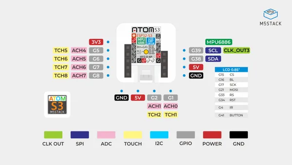

# AtomS3 Dev Kit w/ 0.85-inch Screen

**M5Stack** · ESP32-S3

Revision: Not identified  
Coverage: Pinout image collected

[Browse all manufacturers](../../../../BROWSE.md) · [Desktop app](https://github.com/valleytechsolutions/black-wire-desktop)

## Physical board pinout

**pinout image** · Reviewed source · JPG

[Open original reference](../../../../library/media/0e7a6aa87347eafca4d61543c7ef68657b0ff5d0ecb91680a6e97dbbed0f874e.jpg)

**Credit and rights:** Not established; source attribution retained. Source/manufacturer: M5Stack.

[Source 1](https://m5stack-doc.oss-cn-shenzhen.aliyuncs.com/472/C123_PinMap_01.jpg) · [Source 2](https://docs.m5stack.com/en/core/AtomS3)

Discovered from CircuitPython board metadata and the linked product/documentation page. Exact hardware revision requires matching to the diagram.

SHA-256: `0e7a6aa87347eafca4d61543c7ef68657b0ff5d0ecb91680a6e97dbbed0f874e`

Pin assignments have not been independently electrically verified. Check board revision before wiring.
