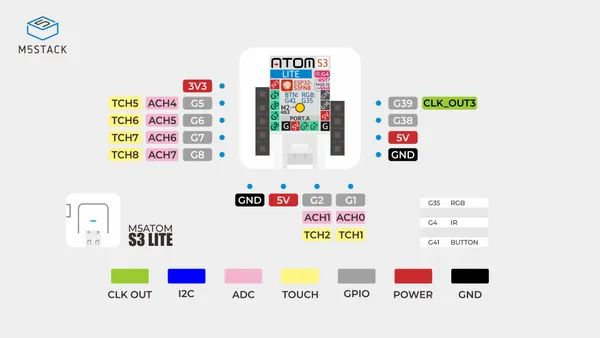

# AtomS3 Lite ESP32S3 Dev Kit

**M5Stack** · ESP32-S3

Revision: Not identified  
Coverage: Pinout image collected

[Browse all manufacturers](../../../../BROWSE.md) · [Devices & IoT](../../../../DEVICES.md) · [Open in the browser guide](https://valleytech-black-wire-guide.pages.dev/?board=m5stack-esp32-atoms3-lite-esp32s3-dev-kit)

Device category: **Controllers & instruments**

## Physical board pinout

**pinout image** · Reviewed source · JPG

[Open original reference](../../../../library/media/e5e70596d5d0f760c1f0c178c4424a030c3e37e38fe90523c6600828581cd610.jpg)

**Credit and rights:** Not established; source attribution retained. Source/manufacturer: M5Stack.

[Source 1](https://m5stack-doc.oss-cn-shenzhen.aliyuncs.com/471/C124_PinMap_01.jpg) · [Source 2](https://docs.m5stack.com/en/core/AtomS3%20Lite)

Discovered from CircuitPython board metadata and the linked product/documentation page. Exact hardware revision requires matching to the diagram.

Image revision: Not identified

SHA-256: `e5e70596d5d0f760c1f0c178c4424a030c3e37e38fe90523c6600828581cd610`

Pin assignments have not been independently electrically verified. Check board revision before wiring.
