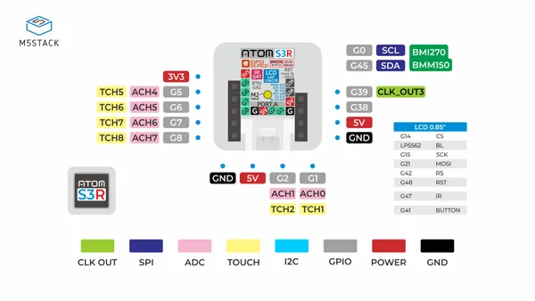

# AtomS3R

**M5Stack** · ESP32-S3

Revision: Not identified  
Coverage: Pinout image collected

[Browse all manufacturers](../../../../BROWSE.md) · [Devices & IoT](../../../../DEVICES.md) · [Open in the browser guide](https://valleytech-black-wire-guide.pages.dev/?board=m5stack-esp32-atoms3r)

Device category: **Controllers & instruments**

## PinMap

**pinout image** · Reviewed source · JPG

[Open original reference](../../../../library/media/5ac773887df642142407b32e7d167e8468c778be2ca58518de0a3a326b4f4d5f.jpg)

**Credit and rights:** Not established; source attribution retained. Source/manufacturer: M5Stack.

[Source 1](https://m5stack-doc.oss-cn-shenzhen.aliyuncs.com/680/C126_PinMap_01.jpg) · [Source 2](https://docs.m5stack.com/en/core/AtomS3R)

Image revision: Not identified

SHA-256: `5ac773887df642142407b32e7d167e8468c778be2ca58518de0a3a326b4f4d5f`

Pin assignments have not been independently electrically verified. Check board revision before wiring.
