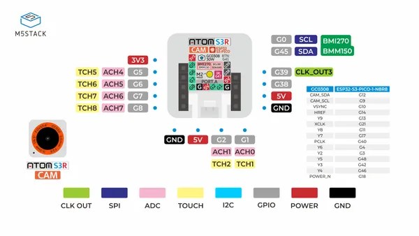
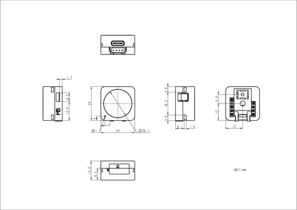

# AtomS3R-CAM

**M5Stack** · ESP32-S3

Revision: Not identified  
Coverage: Pinout image collected

[Browse all manufacturers](../../../../BROWSE.md) · [Desktop app](https://github.com/valleytechsolutions/black-wire-desktop)

## Pinout

**pinout image** · Reviewed source · JPG

[Open original reference](../../../../library/media/5f6b2adae17dcf671160daa54efbc8f5bcca58c1f0116507ead3a96069148715.jpg)

**Credit and rights:** Not established; source attribution retained. Source/manufacturer: M5Stack.

[Source 1](https://m5stack-doc.oss-cn-shenzhen.aliyuncs.com/681/C126-CAM_PinMap_01.jpg) · [Source 2](https://docs.m5stack.com/en/core/AtomS3R%20Cam)

Imported from existing M5Stack Board Reference; original working path preserved.

SHA-256: `5f6b2adae17dcf671160daa54efbc8f5bcca58c1f0116507ead3a96069148715`

## Dimensions

**source reference** · Unreviewed source · PNG

[Open original reference](../../../../library/media/616531139097ee4708fe6adda0905a91a72eef0761e52e09516824033eeaaaf7.png)

**Credit and rights:** Source rights not yet established. Source/manufacturer: M5Stack.

[Source 1](https://static-cdn.m5stack.com/resource/docs/products/core/AtomS3R Cam/img-1f8b0888-c56b-424c-95d3-b67a45015569.png) · [Source 2](https://docs.m5stack.com/en/core/AtomS3R%20Cam)

Original source index: Dimensions. This file is searchable but has not been promoted to a reviewed physical board pinout.

SHA-256: `616531139097ee4708fe6adda0905a91a72eef0761e52e09516824033eeaaaf7`

Pin assignments have not been independently electrically verified. Check board revision before wiring.
