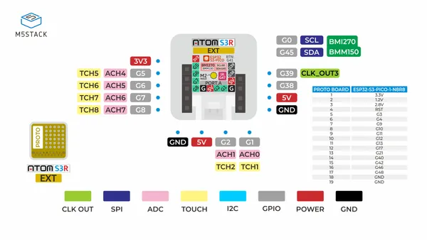
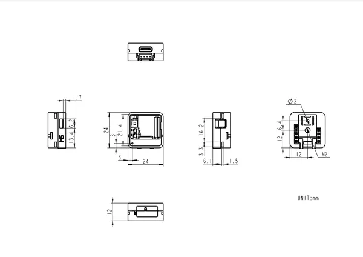

# AtomS3R-Ext

**M5Stack** · ESP32-S3

Revision: Not identified  
Coverage: Pinout image collected

[Browse all manufacturers](../../../../BROWSE.md) · [Desktop app](https://github.com/valleytechsolutions/black-wire-desktop)

## Pinout

**pinout image** · Reviewed source · JPG

[Open original reference](../../../../library/media/c9a248c4e6125c5924aff0cb7af4e2e5706987076d06f60b200f140be4700773.jpg)

**Credit and rights:** Not established; source attribution retained. Source/manufacturer: M5Stack.

[Source 1](https://m5stack-doc.oss-cn-shenzhen.aliyuncs.com/682/C126-Ext_PinMap_01.jpg) · [Source 2](https://docs.m5stack.com/en/core/AtomS3R%20Ext)

Imported from existing M5Stack Board Reference; original working path preserved.

SHA-256: `c9a248c4e6125c5924aff0cb7af4e2e5706987076d06f60b200f140be4700773`

## Dimensions

**source reference** · Unreviewed source · PNG

[Open original reference](../../../../library/media/8022e882c3a2f7efe5e0bd6d3ae1997c3280c84820bf6ff0308e13b8fd0b8897.png)

**Credit and rights:** Source rights not yet established. Source/manufacturer: M5Stack.

[Source 1](https://m5stack.oss-cn-shenzhen.aliyuncs.com/resource/docs/products/core/AtomS3R%20Ext/%E5%B0%BA%E5%AF%B8%E5%9B%BE.png) · [Source 2](https://docs.m5stack.com/en/core/AtomS3R%20Ext)

Original source index: Dimensions. This file is searchable but has not been promoted to a reviewed physical board pinout.

SHA-256: `8022e882c3a2f7efe5e0bd6d3ae1997c3280c84820bf6ff0308e13b8fd0b8897`

Pin assignments have not been independently electrically verified. Check board revision before wiring.
