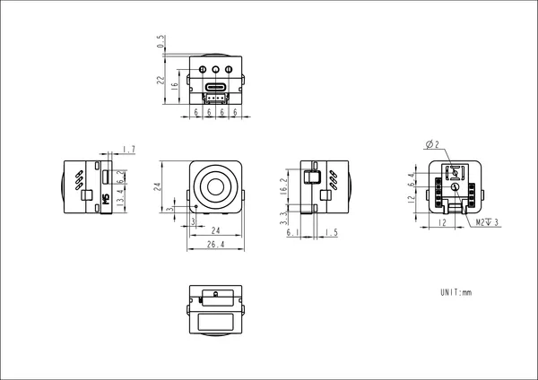

# AtomS3R-M12

**M5Stack** · ESP32-S3

Revision: Not identified  
Coverage: Pinout image collected

[Browse all manufacturers](../../../../BROWSE.md) · [Desktop app](https://github.com/valleytechsolutions/black-wire-desktop)

## Pinout

**pinout image** · Reviewed source · JPG

[Open original reference](../../../../library/media/8e31ba0c03a24246e322fab5d6af4132453425fe4a6548f5c8beb23e029bbbe2.jpg)

**Credit and rights:** Not established; source attribution retained. Source/manufacturer: M5Stack.

[Source 1](https://m5stack-doc.oss-cn-shenzhen.aliyuncs.com/683/C126-M12_PinMap_01.jpg) · [Source 2](https://docs.m5stack.com/en/core/AtomS3R-M12)

Imported from existing M5Stack Board Reference; original working path preserved.

SHA-256: `8e31ba0c03a24246e322fab5d6af4132453425fe4a6548f5c8beb23e029bbbe2`

## Dimensions

**source reference** · Unreviewed source · PNG

[Open original reference](../../../../library/media/3b2f96b2db71feb6fe74fb9eb6fe5cd02f663ba1d166440f00d25260d3ad617b.png)

**Credit and rights:** Source rights not yet established. Source/manufacturer: M5Stack.

[Source 1](https://m5stack-doc.oss-cn-shenzhen.aliyuncs.com/683/C126_M12_Model_Size_sch_01.png) · [Source 2](https://docs.m5stack.com/en/core/AtomS3R-M12)

Original source index: Dimensions. This file is searchable but has not been promoted to a reviewed physical board pinout.

SHA-256: `3b2f96b2db71feb6fe74fb9eb6fe5cd02f663ba1d166440f00d25260d3ad617b`

Pin assignments have not been independently electrically verified. Check board revision before wiring.
