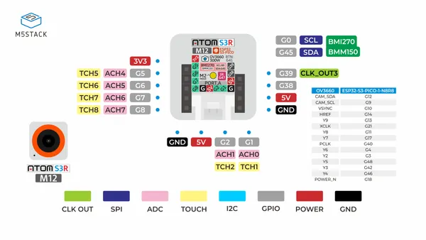

# AtomS3R-M12 Volcengine Kit

**M5Stack** · ESP32-S3

Revision: Not identified  
Coverage: Pinout image collected

[Browse all manufacturers](../../../../BROWSE.md) · [Devices & IoT](../../../../DEVICES.md) · [Open in the browser guide](https://valleytech-black-wire-guide.pages.dev/?board=m5stack-gpio-device-atoms3r-m12-volcengine-kit)

Device category: **Controllers & instruments**

## Pinout

**pinout image** · Reviewed source · JPG

[Open original reference](../../../../library/media/8e31ba0c03a24246e322fab5d6af4132453425fe4a6548f5c8beb23e029bbbe2.jpg)

**Credit and rights:** Not established; source attribution retained. Source/manufacturer: M5Stack.

[Source 1](https://m5stack.oss-cn-shenzhen.aliyuncs.com/resource/docs/products/core/AtomS3R-M12/%E5%8E%9F%E7%90%86%E5%9B%BE-pixel.jpg) · [Source 2](https://docs.m5stack.com/en/core/AtomS3R-M12%20Volcengine%20Kit)

Imported from existing M5Stack Board Reference; original working path preserved.

Image revision: Not identified

SHA-256: `8e31ba0c03a24246e322fab5d6af4132453425fe4a6548f5c8beb23e029bbbe2`

Pin assignments have not been independently electrically verified. Check board revision before wiring.
