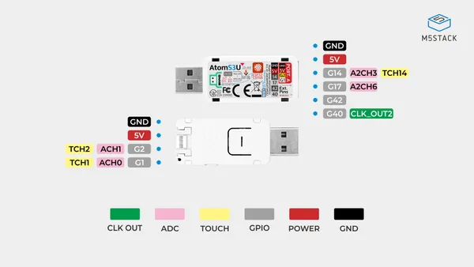
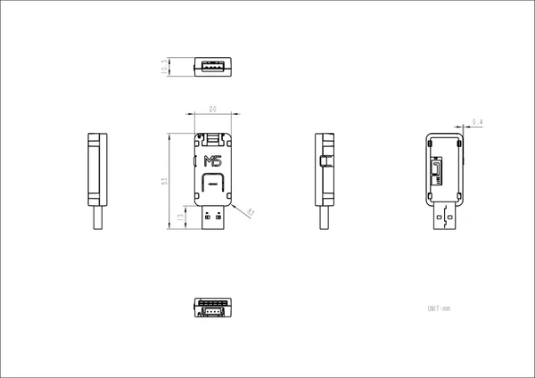

# AtomS3U

**M5Stack** · ESP32-S3

Revision: Not identified  
Coverage: Pinout image collected

[Browse all manufacturers](../../../../BROWSE.md) · [Desktop app](https://github.com/valleytechsolutions/black-wire-desktop)

## Pinout

**pinout image** · Reviewed source · JPG

[Open original reference](../../../../library/media/5dd54cd8f4c46e2aee72aaeef3932a526c149e122c64a68f7ea98a381e6e677c.jpg)

**Credit and rights:** Not established; source attribution retained. Source/manufacturer: M5Stack.

[Source 1](https://m5stack-doc.oss-cn-shenzhen.aliyuncs.com/477/K125_PinMap_01.jpg) · [Source 2](https://docs.m5stack.com/en/core/AtomS3U)

Imported from existing M5Stack Board Reference; original working path preserved.

SHA-256: `5dd54cd8f4c46e2aee72aaeef3932a526c149e122c64a68f7ea98a381e6e677c`

## Dimensions

**source reference** · Unreviewed source · JPG

[Open original reference](../../../../library/media/e13d53c4f1e78d4be962b1d70d640a3362bbf9baca742d0d8f0a2cc947e5690f.jpg)

**Credit and rights:** Source rights not yet established. Source/manufacturer: M5Stack.

[Source 1](https://m5stack.oss-cn-shenzhen.aliyuncs.com/resource/docs/products/core/AtomS3U/module%20size.jpg) · [Source 2](https://docs.m5stack.com/en/core/AtomS3U)

Original source index: Dimensions. This file is searchable but has not been promoted to a reviewed physical board pinout.

SHA-256: `e13d53c4f1e78d4be962b1d70d640a3362bbf9baca742d0d8f0a2cc947e5690f`

Pin assignments have not been independently electrically verified. Check board revision before wiring.
