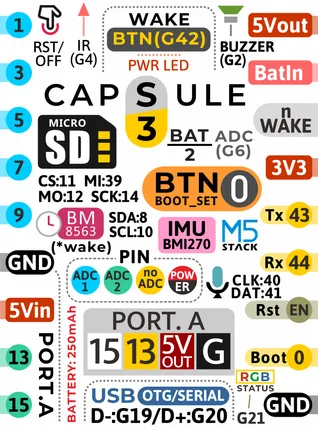
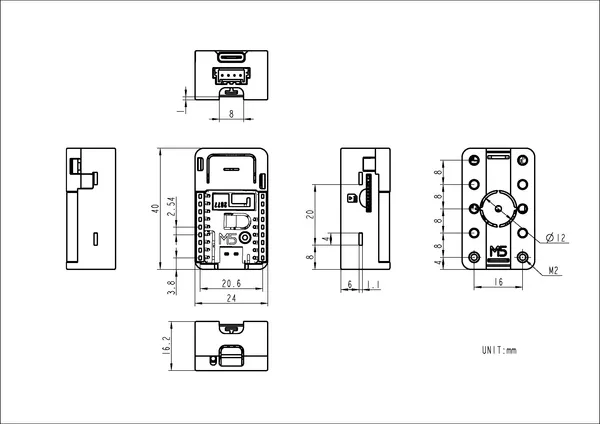

# Capsule

**M5Stack** · ESP32-S3

Revision: Not identified  
Coverage: Pinout image collected

[Browse all manufacturers](../../../../BROWSE.md) · [Desktop app](https://github.com/valleytechsolutions/black-wire-desktop)

## Pinout

**pinout image** · Reviewed source · PNG

[Open original reference](../../../../library/media/8a4ac1dd249c802d6b6746e1cea23f0c3297395fe8cdcdc34a25e341814629e3.png)

**Credit and rights:** Not established; source attribution retained. Source/manufacturer: M5Stack.

[Source 1](https://m5stack-doc.oss-cn-shenzhen.aliyuncs.com/496/K129_CAPSILE-pin-sticker.png) · [Source 2](https://docs.m5stack.com/en/core/M5Capsule)

Imported from existing M5Stack Board Reference; original working path preserved.

SHA-256: `8a4ac1dd249c802d6b6746e1cea23f0c3297395fe8cdcdc34a25e341814629e3`

## Dimensions

**source reference** · Unreviewed source · PNG

[Open original reference](../../../../library/media/0b81f9f17a103b6d50549f854b7ba833bf07171a9c5113c87463e78780fd6207.png)

**Credit and rights:** Source rights not yet established. Source/manufacturer: M5Stack.

[Source 1](https://static-cdn.m5stack.com/resource/docs/products/core/M5Capsule/img-d0063962-c4a3-4f3a-8ce1-b0ebcc998220.png) · [Source 2](https://docs.m5stack.com/en/core/M5Capsule)

Original source index: Dimensions. This file is searchable but has not been promoted to a reviewed physical board pinout.

SHA-256: `0b81f9f17a103b6d50549f854b7ba833bf07171a9c5113c87463e78780fd6207`

Pin assignments have not been independently electrically verified. Check board revision before wiring.
