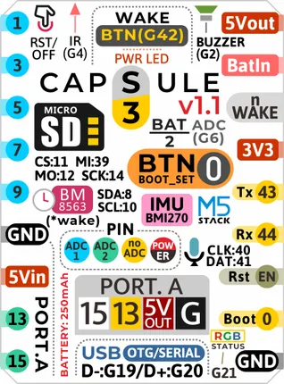
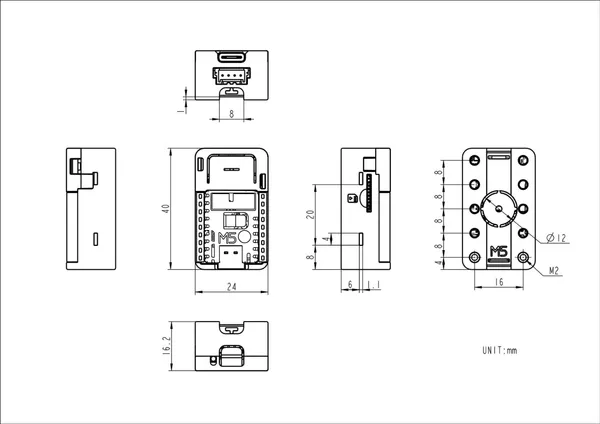

# Capsule v1.1

**M5Stack** · ESP32-S3

Revision: Not identified  
Coverage: Pinout image collected

[Browse all manufacturers](../../../../BROWSE.md) · [Desktop app](https://github.com/valleytechsolutions/black-wire-desktop)

## Pinout

**pinout image** · Reviewed source · JPG

[Open original reference](../../../../library/media/e1af4c20dd897cbe9ab090648bc2df98339fce67b56eff32e99ff5c1079982e6.jpg)

**Credit and rights:** Not established; source attribution retained. Source/manufacturer: M5Stack.

[Source 1](https://m5stack-doc.oss-cn-shenzhen.aliyuncs.com/1248/K129-V11-pinmap-sticker.jpg) · [Source 2](https://docs.m5stack.com/en/core/Capsule_v1.1)

Imported from existing M5Stack Board Reference; original working path preserved.

SHA-256: `e1af4c20dd897cbe9ab090648bc2df98339fce67b56eff32e99ff5c1079982e6`

## Dimensions

**source reference** · Unreviewed source · PNG

[Open original reference](../../../../library/media/e0e441597b91d6fc27686fa9a6eb038a93f06c4f5fe1ce001443db036412daa6.png)

**Credit and rights:** Source rights not yet established. Source/manufacturer: M5Stack.

[Source 1](https://m5stack-doc.oss-cn-shenzhen.aliyuncs.com/1248/K129-V11_Capsule_v1.1_model_size_page_01.png) · [Source 2](https://docs.m5stack.com/en/core/Capsule_v1.1)

Original source index: Dimensions. This file is searchable but has not been promoted to a reviewed physical board pinout.

SHA-256: `e0e441597b91d6fc27686fa9a6eb038a93f06c4f5fe1ce001443db036412daa6`

Pin assignments have not been independently electrically verified. Check board revision before wiring.
