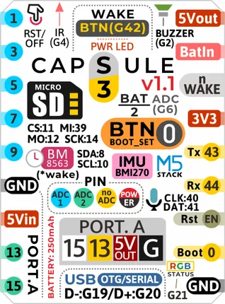
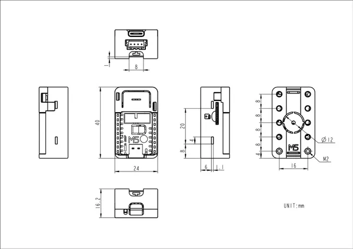
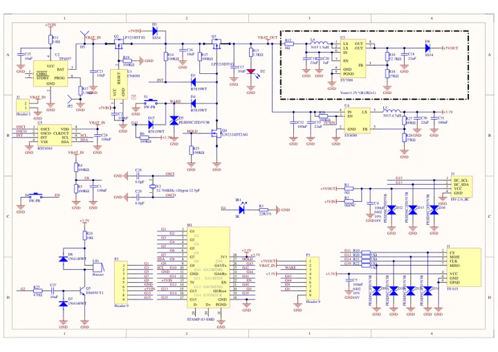

# Capsule v1.1

**M5Stack** · ESP32-S3

Revision: Not identified

Coverage: Manufacturer references reviewed by scope; independent electrical and all-connector review pending

[Browse all manufacturers](../../../../BROWSE.md) · [Devices & IoT](../../../../DEVICES.md) · [Open in the browser guide](https://valleytech-black-wire-guide.pages.dev/?board=m5stack-gpio-device-capsule-v1-1)

Device category: **Wearables**

## Datasheets and original documentation

Board datasheet: **not yet recorded**. Visual reference: **available**.

[Manufacturer hardware documentation](https://docs.m5stack.com/en/core/Capsule_v1.1)

- **schematic / board**: [Capsule v1.1 Schematics PDF](https://m5stack-doc.oss-cn-shenzhen.aliyuncs.com/496/Sch_M5Capsule.pdf) · [saved document](../../../../library/media/d084743583727e028c48654a447ec41c46e26e42885522007368e1672e12ac7e.pdf)
- **schematic / recorded-source**: [Stamp-S3A Schematics PDF](https://m5stack-doc.oss-cn-shenzhen.aliyuncs.com/1150/Sch_StampS3_v0.3.3.pdf) · [saved document](../../../../library/media/2f9610aecc5a5d2ee51b33c75df31cf90c7639d2997e7a2bb147ba8d46b46966.pdf)
- **hardware-guide / board**: [Manufacturer pin and hardware documentation](https://docs.m5stack.com/en/core/Capsule_v1.1) · online

A chip datasheet, schematic and board datasheet have different scopes. Match the exact hardware revision.

[Documentation coverage and remaining gaps](../../../../DOCUMENTATION.md)

## Pinout

**pinout image** · Reviewed source · JPG

[Open original reference](../../../../library/media/e1af4c20dd897cbe9ab090648bc2df98339fce67b56eff32e99ff5c1079982e6.jpg)

**Credit and rights:** Not established; source attribution retained. Source/manufacturer: M5Stack.

[Source 1](https://m5stack-doc.oss-cn-shenzhen.aliyuncs.com/1248/K129-V11-pinmap-sticker.jpg) · [Source 2](https://docs.m5stack.com/en/core/Capsule_v1.1)

Imported from existing M5Stack Board Reference; original working path preserved.

Image revision: Not identified

SHA-256: `e1af4c20dd897cbe9ab090648bc2df98339fce67b56eff32e99ff5c1079982e6`

## Dimensions

**source reference** · Unreviewed source · PNG

[Open original reference](../../../../library/media/e0e441597b91d6fc27686fa9a6eb038a93f06c4f5fe1ce001443db036412daa6.png)

**Credit and rights:** Source rights not yet established. Source/manufacturer: M5Stack.

[Source 1](https://m5stack-doc.oss-cn-shenzhen.aliyuncs.com/1248/K129-V11_Capsule_v1.1_model_size_page_01.png) · [Source 2](https://docs.m5stack.com/en/core/Capsule_v1.1)

Original source index: Dimensions. This file is searchable but has not been promoted to a reviewed physical board pinout.

Image revision: Not identified

SHA-256: `e0e441597b91d6fc27686fa9a6eb038a93f06c4f5fe1ce001443db036412daa6`

## Capsule v1.1 Schematics PDF

**original reference PDF** · Manufacturer source and first-page preview inspected; independent electrical and all-connector completeness review pending. · PDF

[Open original reference](../../../../library/media/d084743583727e028c48654a447ec41c46e26e42885522007368e1672e12ac7e.pdf)

**Credit and rights:** Manufacturer artwork; reuse and print rights not established. Inclusion does not relicense the original.. Source/manufacturer: M5Stack.

[Source 1](https://m5stack-doc.oss-cn-shenzhen.aliyuncs.com/496/Sch_M5Capsule.pdf) · [Source 2](https://docs.m5stack.com/en/core/Capsule_v1.1)

Manufacturer source retained unchanged. Manufacturer source and first-page preview inspected; independent electrical and all-connector completeness review pending.

Image revision: As supplied in the original; match exact board revision

SHA-256: `d084743583727e028c48654a447ec41c46e26e42885522007368e1672e12ac7e`

## Stamp-S3A Schematics PDF

**original reference PDF** · Source identity and visual scope inspected; PDF review covers first-page preview. Independent electrical and all-connector completeness review pending. · PDF

[Open original reference](../../../../library/media/2f9610aecc5a5d2ee51b33c75df31cf90c7639d2997e7a2bb147ba8d46b46966.pdf)

**Credit and rights:** Manufacturer artwork; reuse and print rights not established. Inclusion does not relicense the original.. Source/manufacturer: M5Stack.

[Source 1](https://m5stack-doc.oss-cn-shenzhen.aliyuncs.com/1150/Sch_StampS3_v0.3.3.pdf) · [Source 2](https://docs.m5stack.com/en/core/Capsule_v1.1)

Manufacturer source retained unchanged. Source identity and visual scope inspected; PDF review covers first-page preview. Independent electrical and all-connector completeness review pending.

Image revision: As supplied in the original; match exact board revision

SHA-256: `2f9610aecc5a5d2ee51b33c75df31cf90c7639d2997e7a2bb147ba8d46b46966`

Pin assignments have not been independently electrically verified. Check board revision before wiring.
