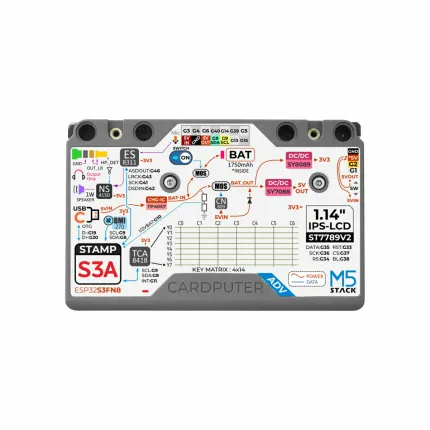
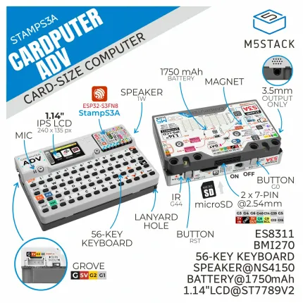

# Cardputer-Adv

**M5Stack** · ESP32-S3

Revision: Not identified  
Coverage: Pinout image collected

[Browse all manufacturers](../../../../BROWSE.md) · [Devices & IoT](../../../../DEVICES.md) · [Open in the browser guide](https://valleytech-black-wire-guide.pages.dev/?board=m5stack-gpio-device-cardputer-adv)

Device category: **Handhelds & pocket tools**

## Rear GPIO and peripheral reference label

**pinout image** · Reviewed source · WEBP

[Open original reference](../../../../library/media/a42e191744a0ef12ed4a8e5b89623b384e1252fd5e6ebbaece763b8f78f96460.webp)

**Credit and rights:** Not established; source attribution retained. Source/manufacturer: M5Stack.

[Source 1](https://m5stack-doc.oss-cn-shenzhen.aliyuncs.com/1178/Cardputer-Adv_06.webp) · [Source 2](https://docs.m5stack.com/en/core/Cardputer-Adv)

Image revision: Not identified

SHA-256: `a42e191744a0ef12ed4a8e5b89623b384e1252fd5e6ebbaece763b8f78f96460`

## Device component and port locations

**board labeling image** · Reviewed source · WEBP

[Open original reference](../../../../library/media/cf8f269682d532e613638e469f60c2ae67b0409611a52a5b212364d05a1a8304.webp)

**Credit and rights:** Not established; source attribution retained. Source/manufacturer: M5Stack.

[Source 1](https://m5stack-doc.oss-cn-shenzhen.aliyuncs.com/1178/Cardputer-Adv_01.webp) · [Source 2](https://docs.m5stack.com/en/core/Cardputer-Adv)

Image revision: Not identified

SHA-256: `cf8f269682d532e613638e469f60c2ae67b0409611a52a5b212364d05a1a8304`

Pin assignments have not been independently electrically verified. Check board revision before wiring.
