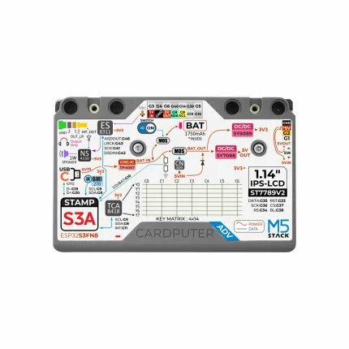
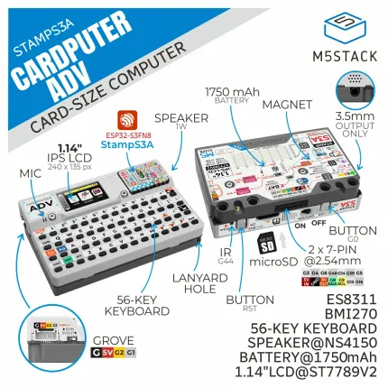

# Cardputer-Adv

**M5Stack** · ESP32-S3

Revision: Not identified

Coverage: Manufacturer references reviewed by scope; independent electrical and all-connector review pending

[Browse all manufacturers](../../../../BROWSE.md) · [Devices & IoT](../../../../DEVICES.md) · [Open in the browser guide](https://valleytech-black-wire-guide.pages.dev/?board=m5stack-gpio-device-cardputer-adv)

Device category: **Handhelds & pocket tools**

## Datasheets and original documentation

Board datasheet: **not yet recorded**. Visual reference: **available**.

[Manufacturer hardware documentation](https://docs.m5stack.com/en/core/Cardputer-Adv)

- **schematic / board**: [Cardputer-Adv Schematics PDF](https://m5stack-doc.oss-cn-shenzhen.aliyuncs.com/1178/Sch_M5CardputerAdv_v1.0_2025_06_20_17_19_58.pdf) · [saved document](../../../../library/media/9553f5ee22b6e5f29a385388192e42c5ff76f16281b6f7ea9418f7b62a2d48b0.pdf)
- **schematic / recorded-source**: [Stamp-S3A Schematics PDF](https://m5stack-doc.oss-cn-shenzhen.aliyuncs.com/1150/Sch_StampS3_v0.3.3.pdf) · [saved document](../../../../library/media/2f9610aecc5a5d2ee51b33c75df31cf90c7639d2997e7a2bb147ba8d46b46966.pdf)
- **hardware-guide / board**: [Manufacturer pin and hardware documentation](https://docs.m5stack.com/en/core/Cardputer-Adv) · online

A chip datasheet, schematic and board datasheet have different scopes. Match the exact hardware revision.

[Documentation coverage and remaining gaps](../../../../DOCUMENTATION.md)

## Rear GPIO and peripheral reference label

**pinout image** · Reviewed source · WEBP

[Open original reference](../../../../library/media/a42e191744a0ef12ed4a8e5b89623b384e1252fd5e6ebbaece763b8f78f96460.webp)

**Credit and rights:** Not established; source attribution retained. Source/manufacturer: M5Stack.

[Source 1](https://m5stack-doc.oss-cn-shenzhen.aliyuncs.com/1178/Cardputer-Adv_06.webp) · [Source 2](https://docs.m5stack.com/en/core/Cardputer-Adv)

Image revision: Not identified

SHA-256: `a42e191744a0ef12ed4a8e5b89623b384e1252fd5e6ebbaece763b8f78f96460`

## Device component and port locations

**board labeling image** · Reviewed source · WEBP

[Open original reference](../../../../library/media/cf8f269682d532e613638e469f60c2ae67b0409611a52a5b212364d05a1a8304.webp)

**Credit and rights:** Not established; source attribution retained. Source/manufacturer: M5Stack.

[Source 1](https://m5stack-doc.oss-cn-shenzhen.aliyuncs.com/1178/Cardputer-Adv_01.webp) · [Source 2](https://docs.m5stack.com/en/core/Cardputer-Adv)

Image revision: Not identified

SHA-256: `cf8f269682d532e613638e469f60c2ae67b0409611a52a5b212364d05a1a8304`

## Cardputer-Adv Schematics PDF

**original reference PDF** · Manufacturer source and first-page preview inspected; independent electrical and all-connector completeness review pending. · PDF

[Open original reference](../../../../library/media/9553f5ee22b6e5f29a385388192e42c5ff76f16281b6f7ea9418f7b62a2d48b0.pdf)

**Credit and rights:** Manufacturer artwork; reuse and print rights not established. Inclusion does not relicense the original.. Source/manufacturer: M5Stack.

[Source 1](https://m5stack-doc.oss-cn-shenzhen.aliyuncs.com/1178/Sch_M5CardputerAdv_v1.0_2025_06_20_17_19_58.pdf) · [Source 2](https://docs.m5stack.com/en/core/Cardputer-Adv)

Manufacturer source retained unchanged. Manufacturer source and first-page preview inspected; independent electrical and all-connector completeness review pending.

Image revision: As supplied in the original; match exact board revision

SHA-256: `9553f5ee22b6e5f29a385388192e42c5ff76f16281b6f7ea9418f7b62a2d48b0`

## Stamp-S3A Schematics PDF

**original reference PDF** · Source identity and visual scope inspected; PDF review covers first-page preview. Independent electrical and all-connector completeness review pending. · PDF

[Open original reference](../../../../library/media/2f9610aecc5a5d2ee51b33c75df31cf90c7639d2997e7a2bb147ba8d46b46966.pdf)

**Credit and rights:** Manufacturer artwork; reuse and print rights not established. Inclusion does not relicense the original.. Source/manufacturer: M5Stack.

[Source 1](https://m5stack-doc.oss-cn-shenzhen.aliyuncs.com/1150/Sch_StampS3_v0.3.3.pdf) · [Source 2](https://docs.m5stack.com/en/core/Cardputer-Adv)

Manufacturer source retained unchanged. Source identity and visual scope inspected; PDF review covers first-page preview. Independent electrical and all-connector completeness review pending.

Image revision: As supplied in the original; match exact board revision

SHA-256: `2f9610aecc5a5d2ee51b33c75df31cf90c7639d2997e7a2bb147ba8d46b46966`

Pin assignments have not been independently electrically verified. Check board revision before wiring.
