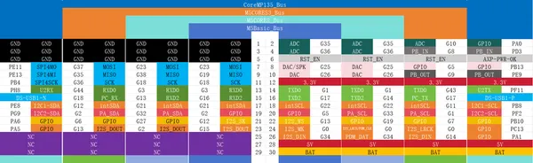
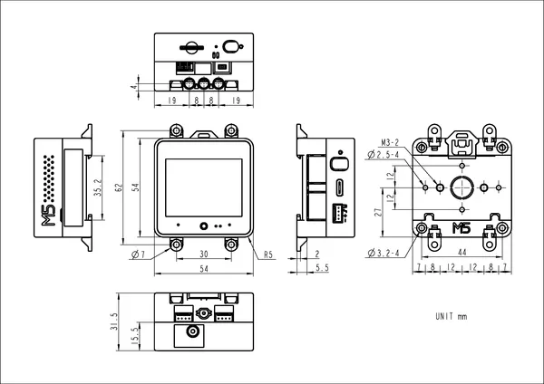

# CoreS3

**M5Stack** · ESP32-S3

Revision: Not identified  
Coverage: GPIO reference collected; physical pinout needed

[Browse all manufacturers](../../../../BROWSE.md) · [Desktop app](https://github.com/valleytechsolutions/black-wire-desktop)

## Pinout

**GPIO reference image** · Reviewed source · PNG

[Open original reference](../../../../library/media/a54886479bb8056bc4f1d3cbff5434f4c70656d7ea41212139513a92a46d4fbd.png)

**Credit and rights:** Not established; source attribution retained. Source/manufacturer: M5Stack.

[Source 1](https://m5stack.oss-cn-shenzhen.aliyuncs.com/resource/docs/products/core/M5CORES3%20SE/c9024cfa50b8d7c31ca7505668770ee.png) · [Source 2](https://docs.m5stack.com/en/core/CoreS3)

Imported from existing M5Stack Board Reference; original working path preserved.

SHA-256: `a54886479bb8056bc4f1d3cbff5434f4c70656d7ea41212139513a92a46d4fbd`

## Dimensions

**source reference** · Unreviewed source · PNG

[Open original reference](../../../../library/media/72972ff58cc25164fb538e0383e198176f7ddcc548f3d9173c6077e5870a0d1a.png)

**Credit and rights:** Source rights not yet established. Source/manufacturer: M5Stack.

[Source 1](https://m5stack.oss-cn-shenzhen.aliyuncs.com/resource/docs/products/core/CoreS3/%E5%B0%BA%E5%AF%B8%E5%9B%BE.png) · [Source 2](https://docs.m5stack.com/en/core/CoreS3)

Original source index: Dimensions. This file is searchable but has not been promoted to a reviewed physical board pinout.

SHA-256: `72972ff58cc25164fb538e0383e198176f7ddcc548f3d9173c6077e5870a0d1a`

Pin assignments have not been independently electrically verified. Check board revision before wiring.
