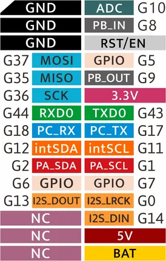
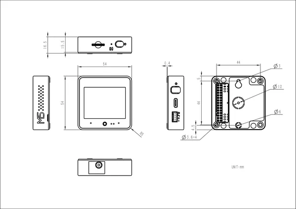

# CoreS3-Lite

**M5Stack** · ESP32-S3

Revision: Not identified  
Coverage: GPIO reference collected; physical pinout needed

[Browse all manufacturers](../../../../BROWSE.md) · [Devices & IoT](../../../../DEVICES.md) · [Open in the browser guide](https://valleytech-black-wire-guide.pages.dev/?board=m5stack-gpio-device-cores3-lite)

Device category: **Controllers & instruments**

## Pinout

**GPIO reference image** · Reviewed source · JPG

[Open original reference](../../../../library/media/f0b35444e46b9bbf7f46e2af280e65b27e654affa3ffba4583208549a5787ae3.jpg)

**Credit and rights:** Not established; source attribution retained. Source/manufacturer: M5Stack.

[Source 1](https://m5stack.oss-cn-shenzhen.aliyuncs.com/resource/docs/products/core/CoreS3/S3.jpg) · [Source 2](https://docs.m5stack.com/en/core/CoreS3-Lite)

Imported from existing M5Stack Board Reference; original working path preserved.

Image revision: Not identified

SHA-256: `f0b35444e46b9bbf7f46e2af280e65b27e654affa3ffba4583208549a5787ae3`

## Dimensions

**source reference** · Unreviewed source · PNG

[Open original reference](../../../../library/media/67b15f2e0d59864c62e0fe872e9e73924229047389ec81a661b5c4d35b5e5398.png)

**Credit and rights:** Source rights not yet established. Source/manufacturer: M5Stack.

[Source 1](https://m5stack-doc.oss-cn-shenzhen.aliyuncs.com/1162/cores3-lite_page_01.png) · [Source 2](https://docs.m5stack.com/en/core/CoreS3-Lite)

Original source index: Dimensions. This file is searchable but has not been promoted to a reviewed physical board pinout.

Image revision: Not identified

SHA-256: `67b15f2e0d59864c62e0fe872e9e73924229047389ec81a661b5c4d35b5e5398`

Pin assignments have not been independently electrically verified. Check board revision before wiring.
