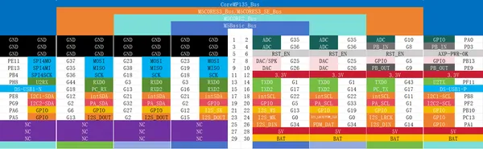

# CoreS3-SE

**M5Stack** · ESP32-S3

Revision: Not identified  
Coverage: GPIO reference collected; physical pinout needed

[Browse all manufacturers](../../../../BROWSE.md) · [Desktop app](https://github.com/valleytechsolutions/black-wire-desktop)

## Pinout

**GPIO reference image** · Reviewed source · PNG

[Open original reference](../../../../library/media/d093a356f67b1d8ecaf5280d35d40c5dba31625ae3297cdf74fd769af72b8ecf.png)

**Credit and rights:** Not established; source attribution retained. Source/manufacturer: M5Stack.

[Source 1](https://m5stack.oss-cn-shenzhen.aliyuncs.com/resource/docs/products/core/M5CORES3%20SE/7d8564d8e14a62cbb1f6b8a718ceb9c.png) · [Source 2](https://docs.m5stack.com/en/core/M5CoreS3%20SE)

Imported from existing M5Stack Board Reference; original working path preserved.

SHA-256: `d093a356f67b1d8ecaf5280d35d40c5dba31625ae3297cdf74fd769af72b8ecf`

Pin assignments have not been independently electrically verified. Check board revision before wiring.
