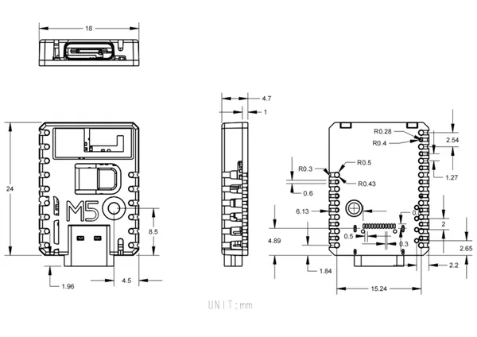

# Stamp-S3

**M5Stack** · ESP32-S3

Revision: Not identified  
Coverage: Pinout image collected

[Browse all manufacturers](../../../../BROWSE.md) · [Desktop app](https://github.com/valleytechsolutions/black-wire-desktop)

## Pinout

**pinout image** · Reviewed source · JPG

[Open original reference](../../../../library/media/37249f2574a8702c053b1807a9793ea4dbf7d44ff7ddccf3640c61a5a9863b77.jpg)

**Credit and rights:** Not established; source attribution retained. Source/manufacturer: M5Stack.

[Source 1](https://m5stack-doc.oss-cn-shenzhen.aliyuncs.com/684/S007_PinMap_01.jpg) · [Source 2](https://docs.m5stack.com/en/core/StampS3)

Imported from existing M5Stack Board Reference; original working path preserved.

SHA-256: `37249f2574a8702c053b1807a9793ea4dbf7d44ff7ddccf3640c61a5a9863b77`

## Dimensions

**source reference** · Unreviewed source · JPG

[Open original reference](../../../../library/media/29cebb00c9c503e1c31176a0843ae67f1988fa5b1e7f15cd587eede25a429fbd.jpg)

**Credit and rights:** Source rights not yet established. Source/manufacturer: M5Stack.

[Source 1](https://m5stack.oss-cn-shenzhen.aliyuncs.com/resource/docs/products/core/StampS3/%E5%B0%BA%E5%AF%B8%E5%9B%BE.jpg) · [Source 2](https://docs.m5stack.com/en/core/StampS3)

Original source index: Dimensions. This file is searchable but has not been promoted to a reviewed physical board pinout.

SHA-256: `29cebb00c9c503e1c31176a0843ae67f1988fa5b1e7f15cd587eede25a429fbd`

Pin assignments have not been independently electrically verified. Check board revision before wiring.
