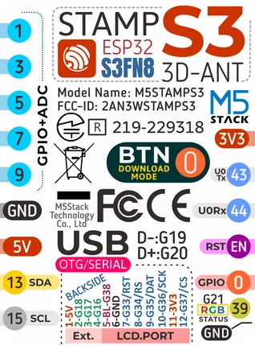
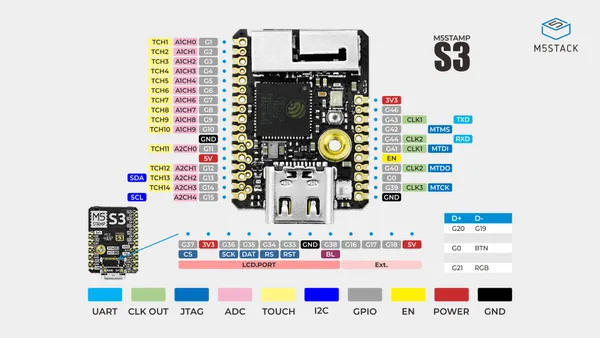

# Stamp-S3 PIN2.54

**M5Stack** · ESP32-S3

Revision: Not identified  
Coverage: Pinout image collected

[Browse all manufacturers](../../../../BROWSE.md) · [Desktop app](https://github.com/valleytechsolutions/black-wire-desktop)

## Pinout

**pinout image** · Reviewed source · PNG

[Open original reference](../../../../library/media/7b3485c05bcd50a560f1ccc593508b8b8b1be6a9c7d96d9a46a6caae4cac70f9.png)

**Credit and rights:** Not established; source attribution retained. Source/manufacturer: M5Stack.

[Source 1](https://m5stack.oss-cn-shenzhen.aliyuncs.com/resource/docs/products/core/M5StampS3%20PIN2.54/254.png) · [Source 2](https://docs.m5stack.com/en/core/M5StampS3%20PIN2.54)

Imported from existing M5Stack Board Reference; original working path preserved.

SHA-256: `7b3485c05bcd50a560f1ccc593508b8b8b1be6a9c7d96d9a46a6caae4cac70f9`

## Pinout

**pinout image** · Reviewed source · JPG

[Open original reference](../../../../library/media/37249f2574a8702c053b1807a9793ea4dbf7d44ff7ddccf3640c61a5a9863b77.jpg)

**Credit and rights:** Not established; source attribution retained. Source/manufacturer: M5Stack.

[Source 1](https://m5stack-doc.oss-cn-shenzhen.aliyuncs.com/684/S007_PinMap_01.jpg) · [Source 2](https://docs.m5stack.com/en/core/M5StampS3%20PIN2.54)

Imported from existing M5Stack Board Reference; original working path preserved.

SHA-256: `37249f2574a8702c053b1807a9793ea4dbf7d44ff7ddccf3640c61a5a9863b77`

Pin assignments have not been independently electrically verified. Check board revision before wiring.
