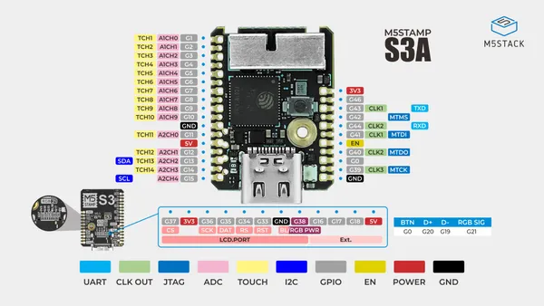

# Stamp-S3A

**M5Stack** · ESP32-S3

Revision: Not identified  
Coverage: Pinout image collected

[Browse all manufacturers](../../../../BROWSE.md) · [Desktop app](https://github.com/valleytechsolutions/black-wire-desktop)

## PinMap

**pinout image** · Reviewed source · JPG

[Open original reference](../../../../library/media/979f3572d60fd9ef9017bb28f0953ba59f48072d7c8bcdfa07f916a3060493d3.jpg)

**Credit and rights:** Not established; source attribution retained. Source/manufacturer: M5Stack.

[Source 1](https://m5stack-doc.oss-cn-shenzhen.aliyuncs.com/1150/S007-V033_PinMap_01.jpg) · [Source 2](https://docs.m5stack.com/en/core/Stamp-S3A)

SHA-256: `979f3572d60fd9ef9017bb28f0953ba59f48072d7c8bcdfa07f916a3060493d3`

Pin assignments have not been independently electrically verified. Check board revision before wiring.
