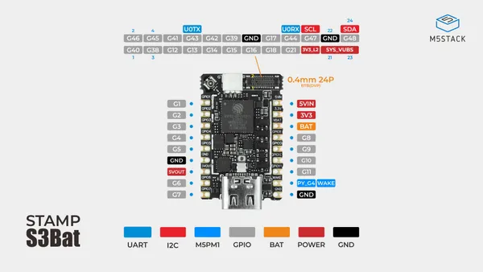
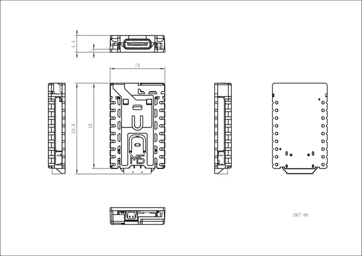

# Stamp-S3Bat

**M5Stack** · ESP32-S3

Revision: Not identified  
Coverage: Pinout image collected

[Browse all manufacturers](../../../../BROWSE.md) · [Desktop app](https://github.com/valleytechsolutions/black-wire-desktop)

## Pinout

**pinout image** · Reviewed source · JPG

[Open original reference](../../../../library/media/d8e651019e9dcb6ca43bf8fb9d141c958bff79ddf74b204c47fa6d35ffc2e4f7.jpg)

**Credit and rights:** Not established; source attribution retained. Source/manufacturer: M5Stack.

[Source 1](https://m5stack-doc.oss-cn-shenzhen.aliyuncs.com/1222/S015-StampS3Bat-pinmap.jpg) · [Source 2](https://docs.m5stack.com/en/core/Stamp-S3Bat)

Imported from existing M5Stack Board Reference; original working path preserved.

SHA-256: `d8e651019e9dcb6ca43bf8fb9d141c958bff79ddf74b204c47fa6d35ffc2e4f7`

## Dimensions

**source reference** · Unreviewed source · PNG

[Open original reference](../../../../library/media/bd9dd5ba466ac5214baf4c9e14411c8595f2c580a29278f02307341ece2998c5.png)

**Credit and rights:** Source rights not yet established. Source/manufacturer: M5Stack.

[Source 1](https://m5stack-doc.oss-cn-shenzhen.aliyuncs.com/1221/S015-stamp-s3BAT_page_01.png) · [Source 2](https://docs.m5stack.com/en/core/Stamp-S3Bat)

Original source index: Dimensions. This file is searchable but has not been promoted to a reviewed physical board pinout.

SHA-256: `bd9dd5ba466ac5214baf4c9e14411c8595f2c580a29278f02307341ece2998c5`

Pin assignments have not been independently electrically verified. Check board revision before wiring.
