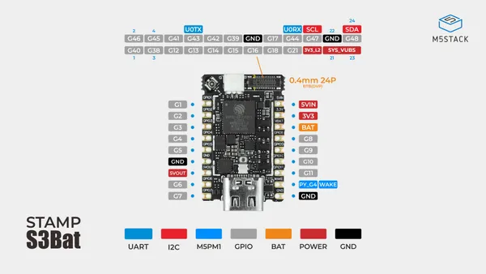
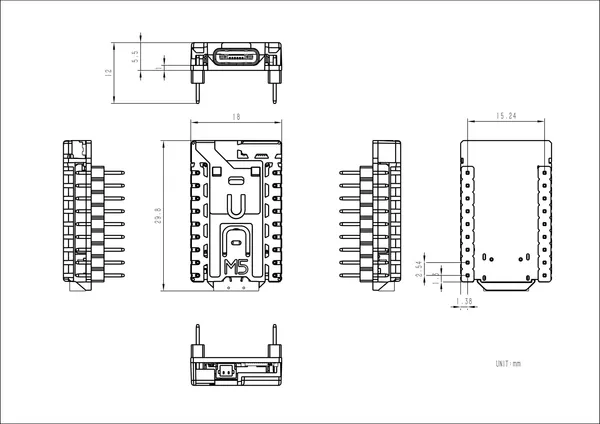
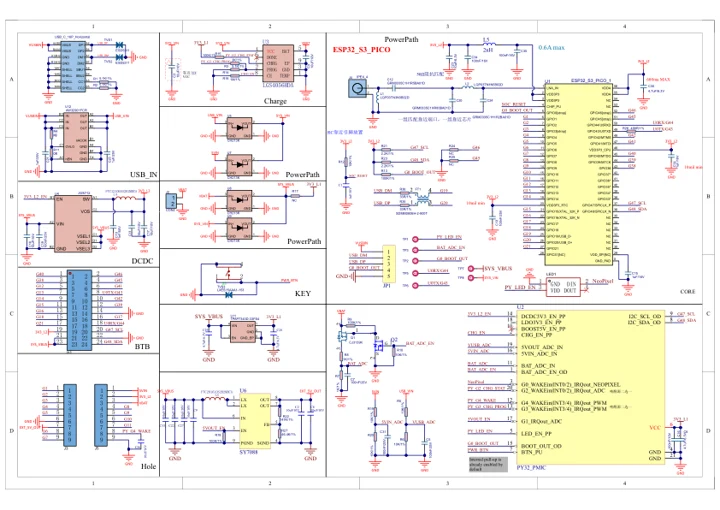

# Stamp-S3Bat DIP

**M5Stack** · ESP32-S3

Revision: Not identified

Coverage: Manufacturer references reviewed by scope; independent electrical and all-connector review pending

[Browse all manufacturers](../../../../BROWSE.md) · [Devices & IoT](../../../../DEVICES.md) · [Open in the browser guide](https://valleytech-black-wire-guide.pages.dev/?board=m5stack-esp32-stamp-s3bat-dip)

## Datasheets and original documentation

Board datasheet: **not yet recorded**. Visual reference: **available**.

[Manufacturer hardware documentation](https://docs.m5stack.com/en/core/Stamp-S3Bat_DIP)

- **schematic / board**: [Stamp-S3Bat DIP Schematics PDF](https://m5stack-doc.oss-cn-shenzhen.aliyuncs.com/1222/S015-SCH_Stamp-S3BAT.pdf) · [saved document](../../../../library/media/f7f3e51b533150ccd9d9b2d945231024b22005440c56b63d0c3cd3afed5414de.pdf)
- **hardware-guide / board**: [Manufacturer pin and hardware documentation](https://docs.m5stack.com/en/core/Stamp-S3Bat_DIP) · online

A chip datasheet, schematic and board datasheet have different scopes. Match the exact hardware revision.

[Documentation coverage and remaining gaps](../../../../DOCUMENTATION.md)

## Pinout

**pinout image** · Reviewed source · JPG

[Open original reference](../../../../library/media/d8e651019e9dcb6ca43bf8fb9d141c958bff79ddf74b204c47fa6d35ffc2e4f7.jpg)

**Credit and rights:** Not established; source attribution retained. Source/manufacturer: M5Stack.

[Source 1](https://m5stack-doc.oss-cn-shenzhen.aliyuncs.com/1222/S015-StampS3Bat-pinmap.jpg) · [Source 2](https://docs.m5stack.com/en/core/Stamp-S3Bat_DIP)

Imported from existing M5Stack Board Reference; original working path preserved.

Image revision: Not identified

SHA-256: `d8e651019e9dcb6ca43bf8fb9d141c958bff79ddf74b204c47fa6d35ffc2e4f7`

## Dimensions

**source reference** · Unreviewed source · PNG

[Open original reference](../../../../library/media/88af624adb1035f049ebfce619fa22156deaec24c912ca70492bb21c5971023d.png)

**Credit and rights:** Source rights not yet established. Source/manufacturer: M5Stack.

[Source 1](https://m5stack-doc.oss-cn-shenzhen.aliyuncs.com/1222/S015-DIP-stamp-s3bat-DIP-model-size_page_01.png) · [Source 2](https://docs.m5stack.com/en/core/Stamp-S3Bat_DIP)

Original source index: Dimensions. This file is searchable but has not been promoted to a reviewed physical board pinout.

Image revision: Not identified

SHA-256: `88af624adb1035f049ebfce619fa22156deaec24c912ca70492bb21c5971023d`

## Stamp-S3Bat DIP Schematics PDF

**original reference PDF** · Manufacturer source and first-page preview inspected; electrical correctness and all-connector completeness not independently approved. · PDF

[Open original reference](../../../../library/media/f7f3e51b533150ccd9d9b2d945231024b22005440c56b63d0c3cd3afed5414de.pdf)

**Credit and rights:** Manufacturer artwork; reuse and print rights not established. Inclusion does not relicense the original.. Source/manufacturer: M5Stack.

[Source 1](https://m5stack-doc.oss-cn-shenzhen.aliyuncs.com/1222/S015-SCH_Stamp-S3BAT.pdf) · [Source 2](https://docs.m5stack.com/en/core/Stamp-S3Bat_DIP)

Manufacturer source retained unchanged. Manufacturer source and first-page preview inspected; electrical correctness and all-connector completeness not independently approved.

Image revision: As supplied in the original; match exact board revision

SHA-256: `f7f3e51b533150ccd9d9b2d945231024b22005440c56b63d0c3cd3afed5414de`

Pin assignments have not been independently electrically verified. Check board revision before wiring.
