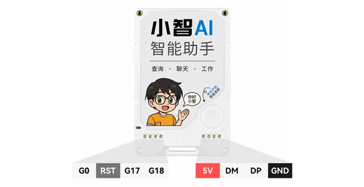
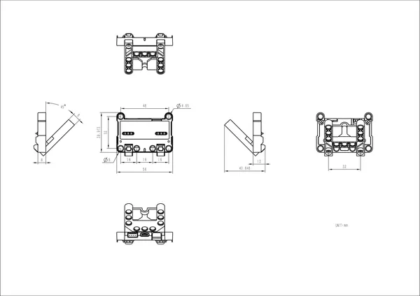
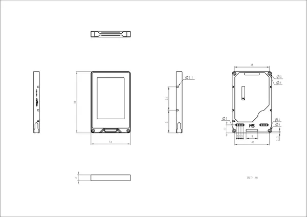

# Xiaozhi Card Kit

**M5Stack** · ESP32-S3

Revision: Not identified  
Coverage: Partial pinout collected; full reference still needed

[Browse all manufacturers](../../../../BROWSE.md) · [Devices & IoT](../../../../DEVICES.md) · [Open in the browser guide](https://valleytech-black-wire-guide.pages.dev/?board=m5stack-gpio-device-xiaozhi-card-kit)

Device category: **Cameras & audio**

## Pinout

**pinout image** · Reviewed source · JPG

[Open original reference](../../../../library/media/f57548d6fbd6ce5643fb59a1adfffe0d805df5aeef02d931fa83c93074130864.jpg)

**Credit and rights:** Not established; source attribution retained. Source/manufacturer: M5Stack.

[Source 1](https://m5stack-doc.oss-cn-shenzhen.aliyuncs.com/1157/xiaozhi_pin_01.jpg) · [Source 2](https://docs.m5stack.com/en/core/Xiaozhi_Card_Kit)

Imported from existing M5Stack Board Reference; original working path preserved. Only the named connector or subsection is covered.

Image revision: Not identified

SHA-256: `f57548d6fbd6ce5643fb59a1adfffe0d805df5aeef02d931fa83c93074130864`

## Dimensions

**source reference** · Unreviewed source · PNG

[Open original reference](../../../../library/media/9e90703d9b2b2e6175a38190d5dec8be347ed9b97554c3725e52ea0760b9aae5.png)

**Credit and rights:** Source rights not yet established. Source/manufacturer: M5Stack.

[Source 1](https://m5stack-doc.oss-cn-shenzhen.aliyuncs.com/1157/Xiaozhi_Card_Base_Size.png) · [Source 2](https://docs.m5stack.com/en/core/Xiaozhi_Card_Kit)

Original source index: Dimensions. This file is searchable but has not been promoted to a reviewed physical board pinout.

Image revision: Not identified

SHA-256: `9e90703d9b2b2e6175a38190d5dec8be347ed9b97554c3725e52ea0760b9aae5`

## Dimensions

**source reference** · Unreviewed source · PNG

[Open original reference](../../../../library/media/07bb94ded4273d48618c525057dc66271b197de9c54344e53e8caa4cc377057d.png)

**Credit and rights:** Source rights not yet established. Source/manufacturer: M5Stack.

[Source 1](https://m5stack-doc.oss-cn-shenzhen.aliyuncs.com/1157/Xiaozhi_Card_Size.png) · [Source 2](https://docs.m5stack.com/en/core/Xiaozhi_Card_Kit)

Original source index: Dimensions. This file is searchable but has not been promoted to a reviewed physical board pinout.

Image revision: Not identified

SHA-256: `07bb94ded4273d48618c525057dc66271b197de9c54344e53e8caa4cc377057d`

Pin assignments have not been independently electrically verified. Check board revision before wiring.
