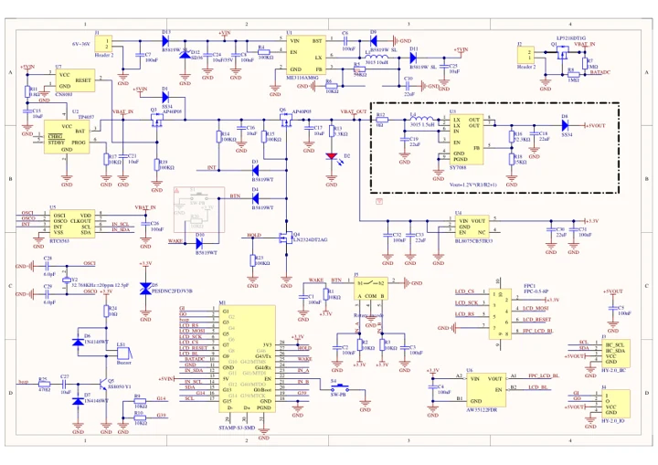

# DinMeter v1.1

**M5Stack** · ESP32-S3FN8

Revision: Match revision in each original source

Coverage: Manufacturer references reviewed by scope; independent electrical and all-connector review pending

[Browse all manufacturers](../../../../BROWSE.md) · [Devices & IoT](../../../../DEVICES.md) · [Open in the browser guide](https://valleytech-black-wire-guide.pages.dev/?board=m5stack-dinmeter-v1-1)

Device category: **Controllers & instruments**

Manufacturer documentation recorded; confirm the exact hardware revision before use.

## Datasheets and original documentation

Board datasheet: **not yet recorded**. Visual reference: **available**.

[Manufacturer hardware documentation](https://docs.m5stack.com/en/core/DinMeter_v1.1)

- **schematic / board**: [DinMeter v1.1 Schematics PDF](https://m5stack-doc.oss-cn-shenzhen.aliyuncs.com/1211/K134-V11_DIN_Meter_v1.0_2025_11_25_17_15_58.pdf) · [saved document](../../../../library/media/03ec335396e4f527119f89f697fca9887505dc1b28077871b2fb361ba6e4c070.pdf)
- **hardware-guide / board**: [Manufacturer pin and hardware documentation](https://docs.m5stack.com/en/core/DinMeter_v1.1) · online

A chip datasheet, schematic and board datasheet have different scopes. Match the exact hardware revision.

[Documentation coverage and remaining gaps](../../../../DOCUMENTATION.md)

## DinMeter v1.1 Schematics PDF

**original reference PDF** · Manufacturer source and first-page preview inspected; independent electrical and all-connector completeness review pending. · PDF

[Open original reference](../../../../library/media/03ec335396e4f527119f89f697fca9887505dc1b28077871b2fb361ba6e4c070.pdf)

**Credit and rights:** Manufacturer artwork; reuse and print rights not established. Inclusion does not relicense the original.. Source/manufacturer: M5Stack.

[Source 1](https://m5stack-doc.oss-cn-shenzhen.aliyuncs.com/1211/K134-V11_DIN_Meter_v1.0_2025_11_25_17_15_58.pdf) · [Source 2](https://docs.m5stack.com/en/core/DinMeter_v1.1)

Manufacturer source retained unchanged. Manufacturer source and first-page preview inspected; independent electrical and all-connector completeness review pending.

Image revision: As supplied in the original; match exact board revision

SHA-256: `03ec335396e4f527119f89f697fca9887505dc1b28077871b2fb361ba6e4c070`

Pin assignments have not been independently electrically verified. Check board revision before wiring.
