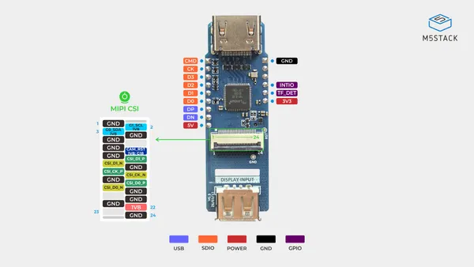
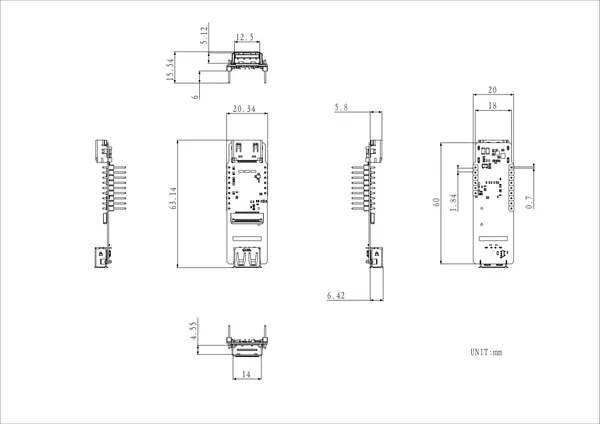

# AddOn Display In For PoE-P4

**M5Stack** · Expansion

Revision: Not identified  
Coverage: Pinout image collected

[Browse all manufacturers](../../../../BROWSE.md) · [Desktop app](https://github.com/valleytechsolutions/black-wire-desktop)

## Pinout

**pinout image** · Reviewed source · JPG

[Open original reference](../../../../library/media/93728a8fb1332d891ea04f35da05161045e76b58534fd420d6c5c478ae6db122.jpg)

**Credit and rights:** Not established; source attribution retained. Source/manufacturer: M5Stack.

[Source 1](https://m5stack-doc.oss-cn-shenzhen.aliyuncs.com/1265/U220_AddOn_Display_In_For_PoE-P4_pinmap.jpg) · [Source 2](https://docs.m5stack.com/en/addon/AddOn_Display_In_For_PoE-P4)

Imported from existing M5Stack Board Reference; original working path preserved.

SHA-256: `93728a8fb1332d891ea04f35da05161045e76b58534fd420d6c5c478ae6db122`

## Dimensions

**source reference** · Unreviewed source · PNG

[Open original reference](../../../../library/media/86d409fd87b3dcb3c75fd4ab438ee6f14282795b7df5cc607a4c87a9f9821e63.png)

**Credit and rights:** Source rights not yet established. Source/manufacturer: M5Stack.

[Source 1](https://m5stack-doc.oss-cn-shenzhen.aliyuncs.com/1265/U220-AddOn_Display_In_For_PoE-P4_model_size_page_01.png) · [Source 2](https://docs.m5stack.com/en/addon/AddOn_Display_In_For_PoE-P4)

Original source index: Dimensions. This file is searchable but has not been promoted to a reviewed physical board pinout.

SHA-256: `86d409fd87b3dcb3c75fd4ab438ee6f14282795b7df5cc607a4c87a9f9821e63`

Pin assignments have not been independently electrically verified. Check board revision before wiring.
