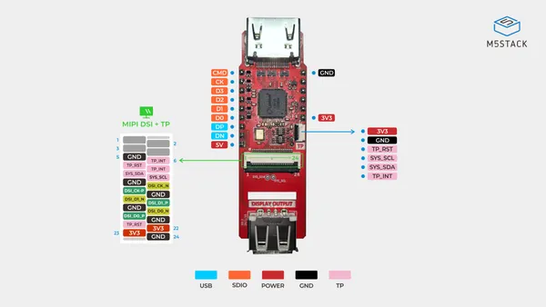
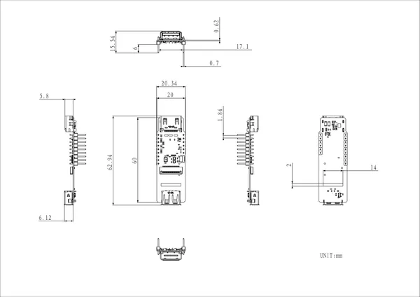

# AddOn Display Out For PoE-P4

**M5Stack** · Expansion

Revision: Not identified  
Coverage: Pinout image collected

[Browse all manufacturers](../../../../BROWSE.md) · [Desktop app](https://github.com/valleytechsolutions/black-wire-desktop)

## Pinout

**pinout image** · Reviewed source · JPG

[Open original reference](../../../../library/media/f5e2f8c1e1a3d2b88d42358634df57f8e3ab97d50a9bbe166d276af12957a615.jpg)

**Credit and rights:** Not established; source attribution retained. Source/manufacturer: M5Stack.

[Source 1](https://m5stack-doc.oss-cn-shenzhen.aliyuncs.com/1253/U221_AddOn_Display_Out_For_PoE-P4_Pinmap.jpg) · [Source 2](https://docs.m5stack.com/en/addon/AddOn_Display_Out_For_PoE-P4)

Imported from existing M5Stack Board Reference; original working path preserved.

SHA-256: `f5e2f8c1e1a3d2b88d42358634df57f8e3ab97d50a9bbe166d276af12957a615`

## Dimensions

**source reference** · Unreviewed source · PNG

[Open original reference](../../../../library/media/2305749b89c5676e075ae2262135cf4272bb79a4366432fa34dcd53fa0570edc.png)

**Credit and rights:** Source rights not yet established. Source/manufacturer: M5Stack.

[Source 1](https://m5stack-doc.oss-cn-shenzhen.aliyuncs.com/1253/U221_AddOn_Display_Out_For_PoE-P4_Pinmap_model_size_page_01.png) · [Source 2](https://docs.m5stack.com/en/addon/AddOn_Display_Out_For_PoE-P4)

Original source index: Dimensions. This file is searchable but has not been promoted to a reviewed physical board pinout.

SHA-256: `2305749b89c5676e075ae2262135cf4272bb79a4366432fa34dcd53fa0570edc`

Pin assignments have not been independently electrically verified. Check board revision before wiring.
