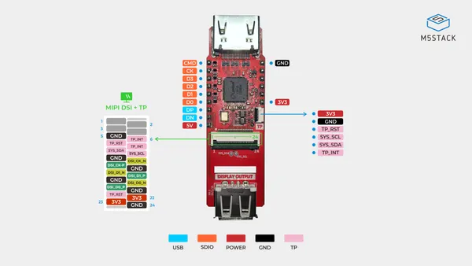
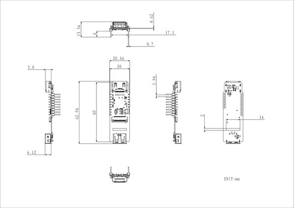
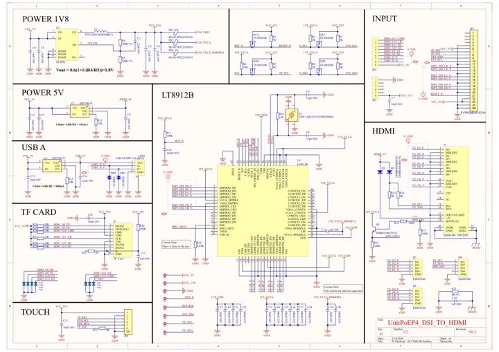

# AddOn Display Out For PoE-P4

**M5Stack** · Expansion

Revision: Not identified

Coverage: Manufacturer references reviewed by scope; independent electrical and all-connector review pending

[Browse all manufacturers](../../../../BROWSE.md) · [Devices & IoT](../../../../DEVICES.md) · [Open in the browser guide](https://valleytech-black-wire-guide.pages.dev/?board=m5stack-expansion-addon-display-out-for-poe-p4)

## Datasheets and original documentation

Board datasheet: **not yet recorded**. Visual reference: **available**.

[Manufacturer hardware documentation](https://docs.m5stack.com/en/addon/AddOn_Display_Out_For_PoE-P4)

- **schematic / board**: [AddOn Display Out For PoE-P4 Schematics PDF](https://m5stack-doc.oss-cn-shenzhen.aliyuncs.com/1253/SCH_Unit_PoE-P4_Display_OUT_V0.2_SCH_PDF_20260319_2026_03_19_16_32_08.pdf) · [saved document](../../../../library/media/b66a47a3a9e232ba4843304cd5d61c3b27e32d4321c33ed19251641cd06d6cd1.pdf)
- **hardware-guide / board**: [Manufacturer pin and hardware documentation](https://docs.m5stack.com/en/addon/AddOn_Display_Out_For_PoE-P4) · online

A chip datasheet, schematic and board datasheet have different scopes. Match the exact hardware revision.

[Documentation coverage and remaining gaps](../../../../DOCUMENTATION.md)

## Pinout

**pinout image** · Reviewed source · JPG

[Open original reference](../../../../library/media/f5e2f8c1e1a3d2b88d42358634df57f8e3ab97d50a9bbe166d276af12957a615.jpg)

**Credit and rights:** Not established; source attribution retained. Source/manufacturer: M5Stack.

[Source 1](https://m5stack-doc.oss-cn-shenzhen.aliyuncs.com/1253/U221_AddOn_Display_Out_For_PoE-P4_Pinmap.jpg) · [Source 2](https://docs.m5stack.com/en/addon/AddOn_Display_Out_For_PoE-P4)

Imported from existing M5Stack Board Reference; original working path preserved.

Image revision: Not identified

SHA-256: `f5e2f8c1e1a3d2b88d42358634df57f8e3ab97d50a9bbe166d276af12957a615`

## Dimensions

**source reference** · Unreviewed source · PNG

[Open original reference](../../../../library/media/2305749b89c5676e075ae2262135cf4272bb79a4366432fa34dcd53fa0570edc.png)

**Credit and rights:** Source rights not yet established. Source/manufacturer: M5Stack.

[Source 1](https://m5stack-doc.oss-cn-shenzhen.aliyuncs.com/1253/U221_AddOn_Display_Out_For_PoE-P4_Pinmap_model_size_page_01.png) · [Source 2](https://docs.m5stack.com/en/addon/AddOn_Display_Out_For_PoE-P4)

Original source index: Dimensions. This file is searchable but has not been promoted to a reviewed physical board pinout.

Image revision: Not identified

SHA-256: `2305749b89c5676e075ae2262135cf4272bb79a4366432fa34dcd53fa0570edc`

## AddOn Display Out For PoE-P4 Schematics PDF

**original reference PDF** · Manufacturer source and first-page preview inspected; electrical correctness and all-connector completeness not independently approved. · PDF

[Open original reference](../../../../library/media/b66a47a3a9e232ba4843304cd5d61c3b27e32d4321c33ed19251641cd06d6cd1.pdf)

**Credit and rights:** Manufacturer artwork; reuse and print rights not established. Inclusion does not relicense the original.. Source/manufacturer: M5Stack.

[Source 1](https://m5stack-doc.oss-cn-shenzhen.aliyuncs.com/1253/SCH_Unit_PoE-P4_Display_OUT_V0.2_SCH_PDF_20260319_2026_03_19_16_32_08.pdf) · [Source 2](https://docs.m5stack.com/en/addon/AddOn_Display_Out_For_PoE-P4)

Manufacturer source retained unchanged. Manufacturer source and first-page preview inspected; electrical correctness and all-connector completeness not independently approved.

Image revision: As supplied in the original; match exact board revision

SHA-256: `b66a47a3a9e232ba4843304cd5d61c3b27e32d4321c33ed19251641cd06d6cd1`

Pin assignments have not been independently electrically verified. Check board revision before wiring.
