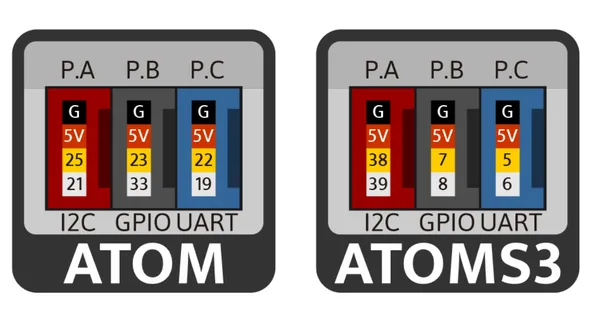
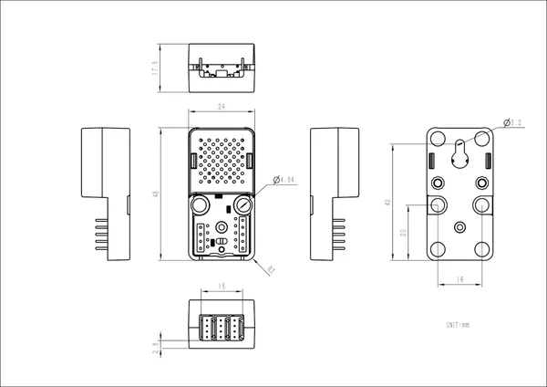

# Atomic Port ABC Base

**M5Stack** · Expansion

Revision: Not identified  
Coverage: Pinout image collected

[Browse all manufacturers](../../../../BROWSE.md) · [Desktop app](https://github.com/valleytechsolutions/black-wire-desktop)

## Pinout

**pinout image** · Reviewed source · PNG

[Open original reference](../../../../library/media/7b8760c1e91164331cd0900c48ab941a5fc990b4a72512beb7df7529f721e925.png)

**Credit and rights:** Not established; source attribution retained. Source/manufacturer: M5Stack.

[Source 1](https://m5stack.oss-cn-shenzhen.aliyuncs.com/resource/docs/products/atom/A130%20AtomPortABC/%E5%9B%BE%E7%89%871.png) · [Source 2](https://docs.m5stack.com/en/atom/AtomPortABC)

Imported from existing M5Stack Board Reference; original working path preserved.

SHA-256: `7b8760c1e91164331cd0900c48ab941a5fc990b4a72512beb7df7529f721e925`

## Dimensions

**source reference** · Unreviewed source · JPG

[Open original reference](../../../../library/media/e16eb060b90633f1f94a21182ff47948f5261330c1394973f976373d00745c49.jpg)

**Credit and rights:** Source rights not yet established. Source/manufacturer: M5Stack.

[Source 1](https://m5stack.oss-cn-shenzhen.aliyuncs.com/resource/docs/products/unit/AtomPortABC/%E5%B0%BA%E5%AF%B8%E5%9B%BE.jpg) · [Source 2](https://docs.m5stack.com/en/atom/AtomPortABC)

Original source index: Dimensions. This file is searchable but has not been promoted to a reviewed physical board pinout.

SHA-256: `e16eb060b90633f1f94a21182ff47948f5261330c1394973f976373d00745c49`

Pin assignments have not been independently electrically verified. Check board revision before wiring.
