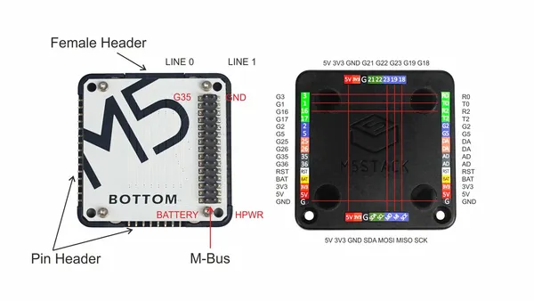

# Base Bottom

**M5Stack** · Expansion

Revision: Not identified

Coverage: Pinout image collected

[Browse all manufacturers](../../../../BROWSE.md) · [Devices & IoT](../../../../DEVICES.md) · [Open in the browser guide](https://valleytech-black-wire-guide.pages.dev/?board=m5stack-expansion-base-bottom)

## Datasheets and original documentation

Board datasheet: **not yet recorded**. Visual reference: **available**.

[Manufacturer source (recorded link)](https://docs.m5stack.com/en/base/core_bottom)

A chip datasheet, schematic and board datasheet have different scopes. Match the exact hardware revision.

[Documentation coverage and remaining gaps](../../../../DOCUMENTATION.md)

## Pinout

**pinout image** · Reviewed source · PNG

[Open original reference](../../../../library/media/2d6cedf02e902fe8dfe4a7a7e1e4eb76a215dac78152bff1246ecd8d0d68e7be.png)

**Credit and rights:** Not established; source attribution retained. Source/manufacturer: M5Stack.

[Source 1](https://static-cdn.m5stack.com/resource/docs/products/base/core_bottom/core_bottom_04.webp) · [Source 2](https://docs.m5stack.com/en/base/core_bottom)

Imported from existing M5Stack Board Reference; original working path preserved.

Image revision: Not identified

SHA-256: `2d6cedf02e902fe8dfe4a7a7e1e4eb76a215dac78152bff1246ecd8d0d68e7be`

Pin assignments have not been independently electrically verified. Check board revision before wiring.
