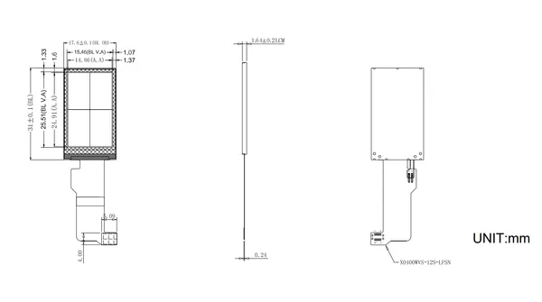

# Display 1.14 For StickS3

**M5Stack** · Expansion

Revision: Not identified  
Coverage: Partial pinout collected; full reference still needed

[Browse all manufacturers](../../../../BROWSE.md) · [Desktop app](https://github.com/valleytechsolutions/black-wire-desktop)

## Pinout

**pinout image** · Reviewed source · JPG

[Open original reference](../../../../library/media/a7d42df665d2e6366724daa714ef4a71975ce6bdc708a52110a9f0b4ab14aef6.jpg)

**Credit and rights:** Not established; source attribution retained. Source/manufacturer: M5Stack.

[Source 1](https://m5stack-doc.oss-cn-shenzhen.aliyuncs.com/1278/A183_Display_1.14_For_StickS3_pinmap.jpg) · [Source 2](https://docs.m5stack.com/en/accessory/display/Display_1.14_For_StickS3)

Imported from existing M5Stack Board Reference; original working path preserved. Only the named connector or subsection is covered.

**Partial diagram. Confirm missing pins against the exact board documentation.**

SHA-256: `a7d42df665d2e6366724daa714ef4a71975ce6bdc708a52110a9f0b4ab14aef6`

## Dimensions

**source reference** · Unreviewed source · PNG

[Open original reference](../../../../library/media/84831c6758301b3e5ede44482f87c74c1f06bf1fc32d42ce7da84a3dc3258969.png)

**Credit and rights:** Source rights not yet established. Source/manufacturer: M5Stack.

[Source 1](https://m5stack-doc.oss-cn-shenzhen.aliyuncs.com/1278/A183_Display_1.14_For_StickS3_page_01.png) · [Source 2](https://docs.m5stack.com/en/accessory/display/Display_1.14_For_StickS3)

Original source index: Dimensions. This file is searchable but has not been promoted to a reviewed physical board pinout.

SHA-256: `84831c6758301b3e5ede44482f87c74c1f06bf1fc32d42ce7da84a3dc3258969`

Pin assignments have not been independently electrically verified. Check board revision before wiring.
