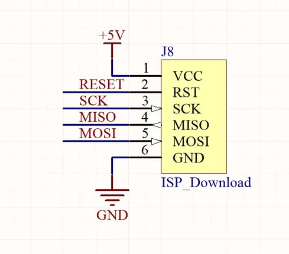

# Faces Gamepad

**M5Stack** · Expansion

Revision: Not identified

Coverage: GPIO reference collected; physical pinout needed

[Browse all manufacturers](../../../../BROWSE.md) · [Devices & IoT](../../../../DEVICES.md) · [Open in the browser guide](https://valleytech-black-wire-guide.pages.dev/?board=m5stack-expansion-faces-gamepad)

## Datasheets and original documentation

Board datasheet: **not yet recorded**. Visual reference: **available**.

[Manufacturer source (recorded link)](https://docs.m5stack.com/en/module/faces_gameboy)

A chip datasheet, schematic and board datasheet have different scopes. Match the exact hardware revision.

[Documentation coverage and remaining gaps](../../../../DOCUMENTATION.md)

## Pinout (ISP Header)

**GPIO reference image** · Reviewed source · PNG

[Open original reference](../../../../library/media/b4d54e2c19d4d31bd8dd28671a8b5ca6540502456486ad74358e884c4906a8c4.png)

**Credit and rights:** Not established; source attribution retained. Source/manufacturer: M5Stack.

[Source 1](https://static-cdn.m5stack.com/resource/docs/products/hat/hat-cardkb/mega328_isp_sch_01.webp) · [Source 2](https://docs.m5stack.com/en/module/faces_gameboy)

Imported from existing M5Stack Board Reference; original working path preserved.

Image revision: Not identified

SHA-256: `b4d54e2c19d4d31bd8dd28671a8b5ca6540502456486ad74358e884c4906a8c4`

Pin assignments have not been independently electrically verified. Check board revision before wiring.
