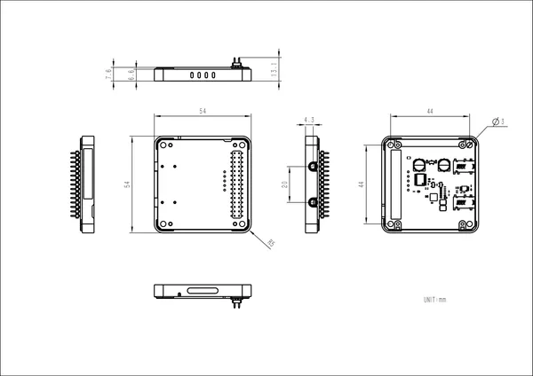

# Module Audio

**M5Stack** · Expansion

Revision: Not identified  
Coverage: Partial pinout collected; full reference still needed

[Browse all manufacturers](../../../../BROWSE.md) · [Desktop app](https://github.com/valleytechsolutions/black-wire-desktop)

## Pinout

**pinout image** · Reviewed source · JPG

[Open original reference](../../../../library/media/a95cc380fa0ae8a7deb825a810458bd80055a98257659207630bc34cc9a42c93.jpg)

**Credit and rights:** Not established; source attribution retained. Source/manufacturer: M5Stack.

[Source 1](https://m5stack-doc.oss-cn-shenzhen.aliyuncs.com/1141/M144_AB_Mode.jpg) · [Source 2](https://docs.m5stack.com/en/module/Module-Audio)

Imported from existing M5Stack Board Reference; original working path preserved. Only the named connector or subsection is covered.

**Partial diagram. Confirm missing pins against the exact board documentation.**

SHA-256: `a95cc380fa0ae8a7deb825a810458bd80055a98257659207630bc34cc9a42c93`

## Dimensions

**source reference** · Unreviewed source · PNG

[Open original reference](../../../../library/media/c18bb915fd9bb98f2366176edb798a80fc1d9c203887bcf871965362b1b67a0f.png)

**Credit and rights:** Source rights not yet established. Source/manufacturer: M5Stack.

[Source 1](https://m5stack-doc.oss-cn-shenzhen.aliyuncs.com/1141/M144_Model_sizel_page_01.png) · [Source 2](https://docs.m5stack.com/en/module/Module-Audio)

Original source index: Dimensions. This file is searchable but has not been promoted to a reviewed physical board pinout.

SHA-256: `c18bb915fd9bb98f2366176edb798a80fc1d9c203887bcf871965362b1b67a0f`

Pin assignments have not been independently electrically verified. Check board revision before wiring.
