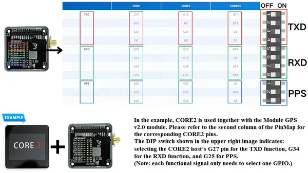
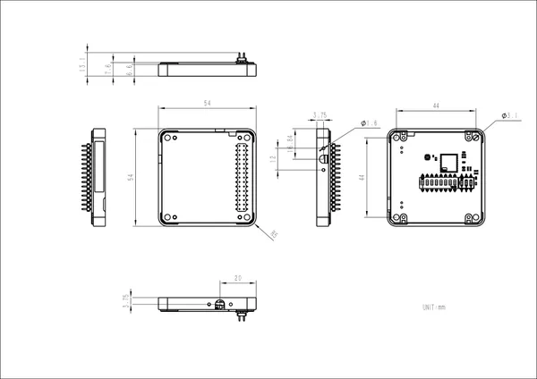

# Module GPS v2.0

**M5Stack** · Expansion

Revision: Not identified  
Coverage: Partial pinout collected; full reference still needed

[Browse all manufacturers](../../../../BROWSE.md) · [Desktop app](https://github.com/valleytechsolutions/black-wire-desktop)

## Pinout

**pinout image** · Reviewed source · JPG

[Open original reference](../../../../library/media/ba9ae005684eb4b90d6d4553561151016485769c074c37ed75a5dae3396f0b0f.jpg)

**Credit and rights:** Not established; source attribution retained. Source/manufacturer: M5Stack.

[Source 1](https://m5stack-doc.oss-cn-shenzhen.aliyuncs.com/950/M003-V2-pinmap-note-en.jpg) · [Source 2](https://docs.m5stack.com/en/module/Module%20GPS%20v2.0)

Imported from existing M5Stack Board Reference; original working path preserved. Only the named connector or subsection is covered.

**Partial diagram. Confirm missing pins against the exact board documentation.**

SHA-256: `ba9ae005684eb4b90d6d4553561151016485769c074c37ed75a5dae3396f0b0f`

## Dimensions

**source reference** · Unreviewed source · JPG

[Open original reference](../../../../library/media/c3dc929f0944e1a130dda9f8c74006fd1380394b02f488d97f88f184879c0a81.jpg)

**Credit and rights:** Source rights not yet established. Source/manufacturer: M5Stack.

[Source 1](https://m5stack.oss-cn-shenzhen.aliyuncs.com/resource/docs/products/module/Module%20GPS%20v2.0/model%20size.jpg) · [Source 2](https://docs.m5stack.com/en/module/Module%20GPS%20v2.0)

Original source index: Dimensions. This file is searchable but has not been promoted to a reviewed physical board pinout.

SHA-256: `c3dc929f0944e1a130dda9f8c74006fd1380394b02f488d97f88f184879c0a81`

Pin assignments have not been independently electrically verified. Check board revision before wiring.
