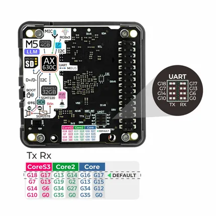
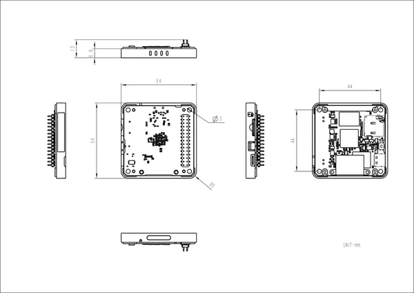

# Module LLM

**M5Stack** · Expansion

Revision: Not identified  
Coverage: Pinout image collected

[Browse all manufacturers](../../../../BROWSE.md) · [Desktop app](https://github.com/valleytechsolutions/black-wire-desktop)

## Pinout

**pinout image** · Reviewed source · JPG

[Open original reference](../../../../library/media/6bdb99d8d30cd11f5acb0e249c72af7a88e247753e048377fc58df8d6d1993bb.jpg)

**Credit and rights:** Not established; source attribution retained. Source/manufacturer: M5Stack.

[Source 1](https://m5stack.oss-cn-shenzhen.aliyuncs.com/resource/docs/products/module/Module%20LLM/03.jpg) · [Source 2](https://docs.m5stack.com/en/module/Module-LLM)

Imported from existing M5Stack Board Reference; original working path preserved.

SHA-256: `6bdb99d8d30cd11f5acb0e249c72af7a88e247753e048377fc58df8d6d1993bb`

## Dimensions

**source reference** · Unreviewed source · JPG

[Open original reference](../../../../library/media/5e0f04c4ead024e5b13988a3b01e84c68cf02aa9291dedca96854335ca0ff1ad.jpg)

**Credit and rights:** Source rights not yet established. Source/manufacturer: M5Stack.

[Source 1](https://m5stack.oss-cn-shenzhen.aliyuncs.com/resource/docs/products/module/Module%20LLM/%E5%B0%BA%E5%AF%B8%E5%9B%BE.jpg) · [Source 2](https://docs.m5stack.com/en/module/Module-LLM)

Original source index: Dimensions. This file is searchable but has not been promoted to a reviewed physical board pinout.

SHA-256: `5e0f04c4ead024e5b13988a3b01e84c68cf02aa9291dedca96854335ca0ff1ad`

Pin assignments have not been independently electrically verified. Check board revision before wiring.
