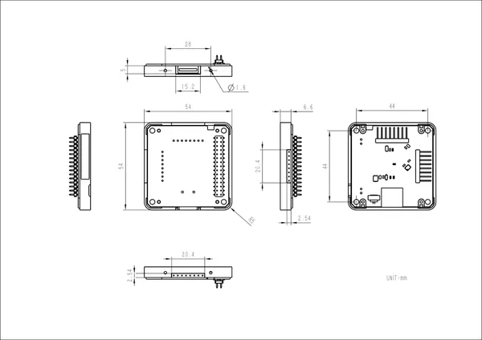

# Module USB v1.2

**M5Stack** · Expansion

Revision: Not identified  
Coverage: GPIO reference collected; physical pinout needed

[Browse all manufacturers](../../../../BROWSE.md) · [Desktop app](https://github.com/valleytechsolutions/black-wire-desktop)

## Pinout

**GPIO reference image** · Reviewed source · PNG

[Open original reference](../../../../library/media/96cbf04b32462969243a80711a48211248287b7847dcd8e9f68faa3cbbba8f23.png)

**Credit and rights:** Not established; source attribution retained. Source/manufacturer: M5Stack.

[Source 1](https://static-cdn.m5stack.com/resource/docs/products/module/USB v1.2 Module/pinMap-70b8e2ad-8325-4887-af33-44e3dae91520.png) · [Source 2](https://docs.m5stack.com/en/module/USB%20v1.2%20Module)

Imported from existing M5Stack Board Reference; original working path preserved.

SHA-256: `96cbf04b32462969243a80711a48211248287b7847dcd8e9f68faa3cbbba8f23`

## Dimensions

**source reference** · Unreviewed source · JPG

[Open original reference](../../../../library/media/904223cb5b5913b4ed81f3b22f427c258dccb46529ec5e6b03682a4365b29723.jpg)

**Credit and rights:** Source rights not yet established. Source/manufacturer: M5Stack.

[Source 1](https://static-cdn.m5stack.com/resource/docs/products/module/USB v1.2 Module/img-76853f1e-17c5-4a94-9c66-74e1b150a27c.jpg) · [Source 2](https://docs.m5stack.com/en/module/USB%20v1.2%20Module)

Original source index: Dimensions. This file is searchable but has not been promoted to a reviewed physical board pinout.

SHA-256: `904223cb5b5913b4ed81f3b22f427c258dccb46529ec5e6b03682a4365b29723`

Pin assignments have not been independently electrically verified. Check board revision before wiring.
