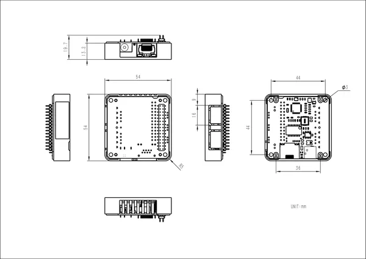

# Module13.2 LAN

**M5Stack** · Expansion

Revision: Not identified  
Coverage: Partial pinout collected; full reference still needed

[Browse all manufacturers](../../../../BROWSE.md) · [Desktop app](https://github.com/valleytechsolutions/black-wire-desktop)

## Pinout

**pinout image** · Reviewed source · PNG

[Open original reference](../../../../library/media/673be65512a92b4543eff73255b9ef4ede1262f132a79bc40b0c2e570ef803a6.png)

**Credit and rights:** Not established; source attribution retained. Source/manufacturer: M5Stack.

[Source 1](https://m5stack-doc.oss-cn-shenzhen.aliyuncs.com/957/M136_pins_change_01.png) · [Source 2](https://docs.m5stack.com/en/module/LAN%20Module%2013.2)

Imported from existing M5Stack Board Reference; original working path preserved. Only the named connector or subsection is covered.

**Partial diagram. Confirm missing pins against the exact board documentation.**

SHA-256: `673be65512a92b4543eff73255b9ef4ede1262f132a79bc40b0c2e570ef803a6`

## Dimensions

**source reference** · Unreviewed source · PNG

[Open original reference](../../../../library/media/fa3d8e7857a4f8caa7b492fe23be10c0ac6d305431deb96ce8991687dc7a6eff.png)

**Credit and rights:** Source rights not yet established. Source/manufacturer: M5Stack.

[Source 1](https://m5stack-doc.oss-cn-shenzhen.aliyuncs.com/957/lan-module_page_01.png) · [Source 2](https://docs.m5stack.com/en/module/LAN%20Module%2013.2)

Original source index: Dimensions. This file is searchable but has not been promoted to a reviewed physical board pinout.

SHA-256: `fa3d8e7857a4f8caa7b492fe23be10c0ac6d305431deb96ce8991687dc7a6eff`

Pin assignments have not been independently electrically verified. Check board revision before wiring.
