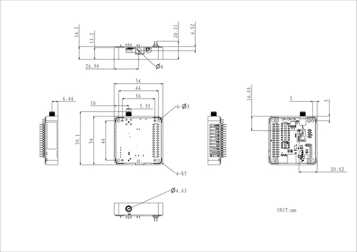

# Module13.2 LoRa-1262

**M5Stack** · Expansion

Revision: Not identified  
Coverage: Partial pinout collected; full reference still needed

[Browse all manufacturers](../../../../BROWSE.md) · [Desktop app](https://github.com/valleytechsolutions/black-wire-desktop)

## Pinout

**pinout image** · Reviewed source · PNG

[Open original reference](../../../../library/media/f7fe0223690398b6365b0d26ea3a412b97cd8ddf6e4f791a57515d47f187cbf0.png)

**Credit and rights:** Not established; source attribution retained. Source/manufacturer: M5Stack.

[Source 1](https://m5stack-doc.oss-cn-shenzhen.aliyuncs.com/1277/M149_Module13.2_LoRa-1262_pin_switch.png) · [Source 2](https://docs.m5stack.com/en/module/Module13.2_LoRa-1262)

Imported from existing M5Stack Board Reference; original working path preserved. Only the named connector or subsection is covered.

**Partial diagram. Confirm missing pins against the exact board documentation.**

SHA-256: `f7fe0223690398b6365b0d26ea3a412b97cd8ddf6e4f791a57515d47f187cbf0`

## Dimensions

**source reference** · Unreviewed source · PNG

[Open original reference](../../../../library/media/735a49ddf20a5155a0af0ec2781e98416e2698aa57b283c34dca04a7a045c720.png)

**Credit and rights:** Source rights not yet established. Source/manufacturer: M5Stack.

[Source 1](https://m5stack-doc.oss-cn-shenzhen.aliyuncs.com/1277/M149_Module13.2_LoRa-1262_model_size_page_01.png) · [Source 2](https://docs.m5stack.com/en/module/Module13.2_LoRa-1262)

Original source index: Dimensions. This file is searchable but has not been promoted to a reviewed physical board pinout.

SHA-256: `735a49ddf20a5155a0af0ec2781e98416e2698aa57b283c34dca04a7a045c720`

Pin assignments have not been independently electrically verified. Check board revision before wiring.
