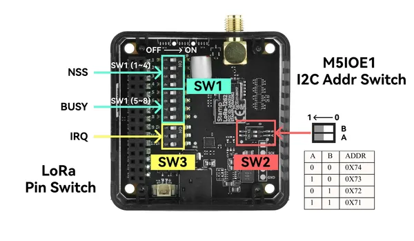
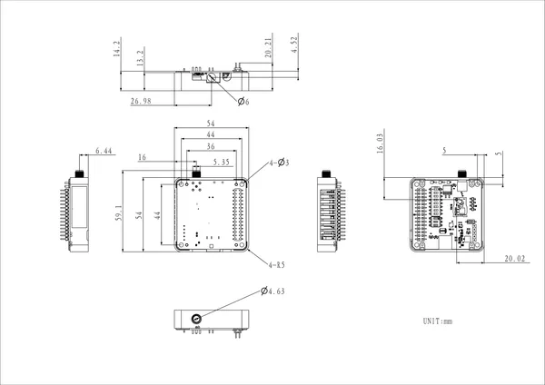
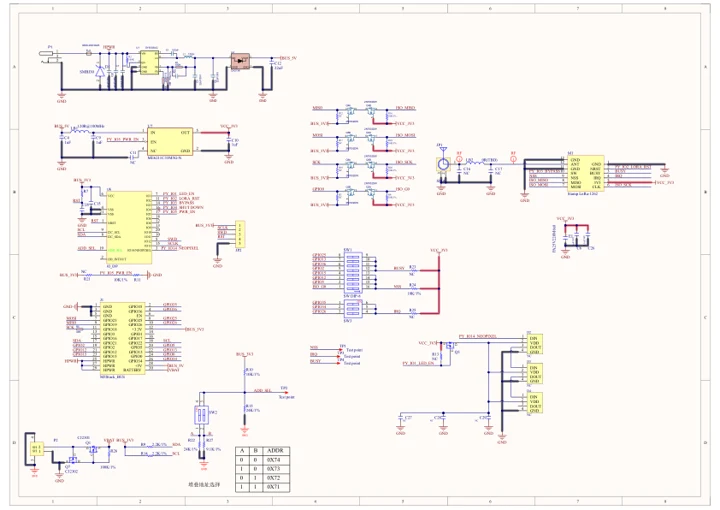

# Module13.2 LoRa-1262

**M5Stack** · Expansion

Revision: Not identified

Coverage: Manufacturer references reviewed by scope; independent electrical and all-connector review pending

[Browse all manufacturers](../../../../BROWSE.md) · [Devices & IoT](../../../../DEVICES.md) · [Open in the browser guide](https://valleytech-black-wire-guide.pages.dev/?board=m5stack-expansion-module13-2-lora-1262)

## Datasheets and original documentation

Board datasheet: **not yet recorded**. Visual reference: **available**.

[Manufacturer hardware documentation](https://docs.m5stack.com/en/module/Module13.2_LoRa-1262)

- **schematic / board**: [Module13.2 LoRa-1262 Schematics PDF](https://m5stack-doc.oss-cn-shenzhen.aliyuncs.com/1277/SCH_Module13.2_LoRa1262_V1.0_2026_09_02_17_15_18.pdf) · [saved document](../../../../library/media/ac12e7fc58de0798b06186e5c2339f553d70f6d34e533a58b401c3d509feba84.pdf)
- **hardware-guide / board**: [Manufacturer pin and hardware documentation](https://docs.m5stack.com/en/module/Module13.2_LoRa-1262) · online

A chip datasheet, schematic and board datasheet have different scopes. Match the exact hardware revision.

[Documentation coverage and remaining gaps](../../../../DOCUMENTATION.md)

## Pinout

**pinout image** · Reviewed source · PNG

[Open original reference](../../../../library/media/f7fe0223690398b6365b0d26ea3a412b97cd8ddf6e4f791a57515d47f187cbf0.png)

**Credit and rights:** Not established; source attribution retained. Source/manufacturer: M5Stack.

[Source 1](https://m5stack-doc.oss-cn-shenzhen.aliyuncs.com/1277/M149_Module13.2_LoRa-1262_pin_switch.png) · [Source 2](https://docs.m5stack.com/en/module/Module13.2_LoRa-1262)

Imported from existing M5Stack Board Reference; original working path preserved. Only the named connector or subsection is covered.

Image revision: Not identified

SHA-256: `f7fe0223690398b6365b0d26ea3a412b97cd8ddf6e4f791a57515d47f187cbf0`

## Dimensions

**source reference** · Unreviewed source · PNG

[Open original reference](../../../../library/media/735a49ddf20a5155a0af0ec2781e98416e2698aa57b283c34dca04a7a045c720.png)

**Credit and rights:** Source rights not yet established. Source/manufacturer: M5Stack.

[Source 1](https://m5stack-doc.oss-cn-shenzhen.aliyuncs.com/1277/M149_Module13.2_LoRa-1262_model_size_page_01.png) · [Source 2](https://docs.m5stack.com/en/module/Module13.2_LoRa-1262)

Original source index: Dimensions. This file is searchable but has not been promoted to a reviewed physical board pinout.

Image revision: Not identified

SHA-256: `735a49ddf20a5155a0af0ec2781e98416e2698aa57b283c34dca04a7a045c720`

## Module13.2 LoRa-1262 Schematics PDF

**original reference PDF** · Manufacturer source and first-page preview inspected; electrical correctness and all-connector completeness not independently approved. · PDF

[Open original reference](../../../../library/media/ac12e7fc58de0798b06186e5c2339f553d70f6d34e533a58b401c3d509feba84.pdf)

**Credit and rights:** Manufacturer artwork; reuse and print rights not established. Inclusion does not relicense the original.. Source/manufacturer: M5Stack.

[Source 1](https://m5stack-doc.oss-cn-shenzhen.aliyuncs.com/1277/SCH_Module13.2_LoRa1262_V1.0_2026_09_02_17_15_18.pdf) · [Source 2](https://docs.m5stack.com/en/module/Module13.2_LoRa-1262)

Manufacturer source retained unchanged. Manufacturer source and first-page preview inspected; electrical correctness and all-connector completeness not independently approved.

Image revision: As supplied in the original; match exact board revision

SHA-256: `ac12e7fc58de0798b06186e5c2339f553d70f6d34e533a58b401c3d509feba84`

Pin assignments have not been independently electrically verified. Check board revision before wiring.
