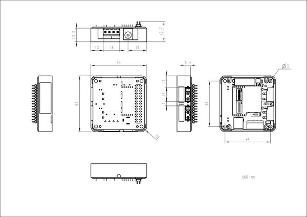

# Module13.2 PwrCAN

**M5Stack** · Expansion

Revision: Not identified  
Coverage: Partial pinout collected; full reference still needed

[Browse all manufacturers](../../../../BROWSE.md) · [Desktop app](https://github.com/valleytechsolutions/black-wire-desktop)

## Pinout

**pinout image** · Reviewed source · PNG

[Open original reference](../../../../library/media/db793dbaa8bb1213a6809544158369f6bbe7af8c54ecc98084ecd04c6e9d4e91.png)

**Credit and rights:** Not established; source attribution retained. Source/manufacturer: M5Stack.

[Source 1](https://m5stack.oss-cn-shenzhen.aliyuncs.com/resource/docs/products/module/Module13.2-PwrCAN/38c324f157b3ec044fbe91acfb0571b.png) · [Source 2](https://docs.m5stack.com/en/module/Module13.2-PwrCAN)

Imported from existing M5Stack Board Reference; original working path preserved. Only the named connector or subsection is covered.

**Partial diagram. Confirm missing pins against the exact board documentation.**

SHA-256: `db793dbaa8bb1213a6809544158369f6bbe7af8c54ecc98084ecd04c6e9d4e91`

## Dimensions

**source reference** · Unreviewed source · JPG

[Open original reference](../../../../library/media/7115cfbb7c3c58bd052dcffdcd59e2551f845f27bc86d6fcc1f8cbf25fa10335.jpg)

**Credit and rights:** Source rights not yet established. Source/manufacturer: M5Stack.

[Source 1](https://static-cdn.m5stack.com/resource/docs/products/module/Module13.2-PwrCAN/img-66ce1d4e-78ae-497f-bd11-ed33e4d5fdcb.jpg) · [Source 2](https://docs.m5stack.com/en/module/Module13.2-PwrCAN)

Original source index: Dimensions. This file is searchable but has not been promoted to a reviewed physical board pinout.

SHA-256: `7115cfbb7c3c58bd052dcffdcd59e2551f845f27bc86d6fcc1f8cbf25fa10335`

Pin assignments have not been independently electrically verified. Check board revision before wiring.
