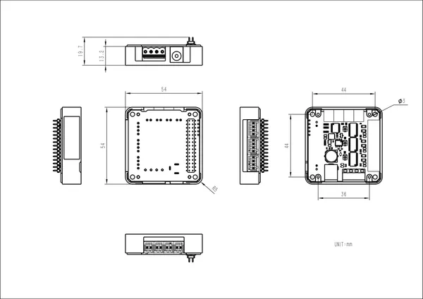

# Module13.2 Stepmotor Driver v1.1

**M5Stack** · Expansion

Revision: Not identified  
Coverage: Partial pinout collected; full reference still needed

[Browse all manufacturers](../../../../BROWSE.md) · [Desktop app](https://github.com/valleytechsolutions/black-wire-desktop)

## Pinout

**pinout image** · Reviewed source · PNG

[Open original reference](../../../../library/media/a02209c512ad7ff1e880b7f34d168284a9e01d589c5c3f4edcfcc334ddf7c26a.png)

**Credit and rights:** Not established; source attribution retained. Source/manufacturer: M5Stack.

[Source 1](https://m5stack.oss-cn-shenzhen.aliyuncs.com/resource/docs/products/module/Stepmotor%20Driver%20Module13.2%20v1.1/M5PPT%20(2).png) · [Source 2](https://docs.m5stack.com/en/module/Stepmotor%20Driver%20Module13.2%20v1.1)

Imported from existing M5Stack Board Reference; original working path preserved. Only the named connector or subsection is covered.

**Partial diagram. Confirm missing pins against the exact board documentation.**

SHA-256: `a02209c512ad7ff1e880b7f34d168284a9e01d589c5c3f4edcfcc334ddf7c26a`

## Dimensions

**source reference** · Unreviewed source · PNG

[Open original reference](../../../../library/media/03ede1660c9f49e212ad44b41483e6891e8bd0175a768cae67705de2ab2efd9b.png)

**Credit and rights:** Source rights not yet established. Source/manufacturer: M5Stack.

[Source 1](https://m5stack-doc.oss-cn-shenzhen.aliyuncs.com/972/stepmotorDriver_page_01.png) · [Source 2](https://docs.m5stack.com/en/module/Stepmotor%20Driver%20Module13.2%20v1.1)

Original source index: Dimensions. This file is searchable but has not been promoted to a reviewed physical board pinout.

SHA-256: `03ede1660c9f49e212ad44b41483e6891e8bd0175a768cae67705de2ab2efd9b`

Pin assignments have not been independently electrically verified. Check board revision before wiring.
