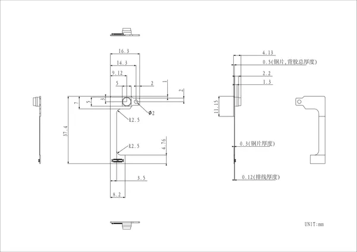

# Stamp-AddOn Cam0308

**M5Stack** · Expansion

Revision: Not identified  
Coverage: Partial pinout collected; full reference still needed

[Browse all manufacturers](../../../../BROWSE.md) · [Desktop app](https://github.com/valleytechsolutions/black-wire-desktop)

## Pinout

**pinout image** · Reviewed source · JPG

[Open original reference](../../../../library/media/2bcadb6f753a6e980a83ae5da55a4a2807d09d2052fb83a003db8fd1633cfe93.jpg)

**Credit and rights:** Not established; source attribution retained. Source/manufacturer: M5Stack.

[Source 1](https://m5stack-doc.oss-cn-shenzhen.aliyuncs.com/1256/A178_Stamp-AddOn_Cam0308_pinmap.jpg) · [Source 2](https://docs.m5stack.com/en/stamp/Stamp-AddOn_Cam0308)

Imported from existing M5Stack Board Reference; original working path preserved. Only the named connector or subsection is covered.

**Partial diagram. Confirm missing pins against the exact board documentation.**

SHA-256: `2bcadb6f753a6e980a83ae5da55a4a2807d09d2052fb83a003db8fd1633cfe93`

## Dimensions

**source reference** · Unreviewed source · PNG

[Open original reference](../../../../library/media/7c3777e7d42d664539e0cc2f47192a04668d4e54b4c1eea247319f25fc81b80d.png)

**Credit and rights:** Source rights not yet established. Source/manufacturer: M5Stack.

[Source 1](https://m5stack-doc.oss-cn-shenzhen.aliyuncs.com/1256/A178_Stamp-AddOn_Cam0308_model_size_page_01.png) · [Source 2](https://docs.m5stack.com/en/stamp/Stamp-AddOn_Cam0308)

Original source index: Dimensions. This file is searchable but has not been promoted to a reviewed physical board pinout.

SHA-256: `7c3777e7d42d664539e0cc2f47192a04668d4e54b4c1eea247319f25fc81b80d`

Pin assignments have not been independently electrically verified. Check board revision before wiring.
