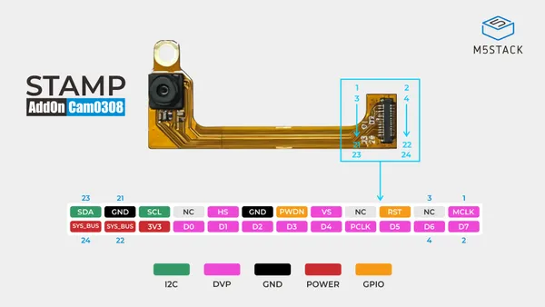
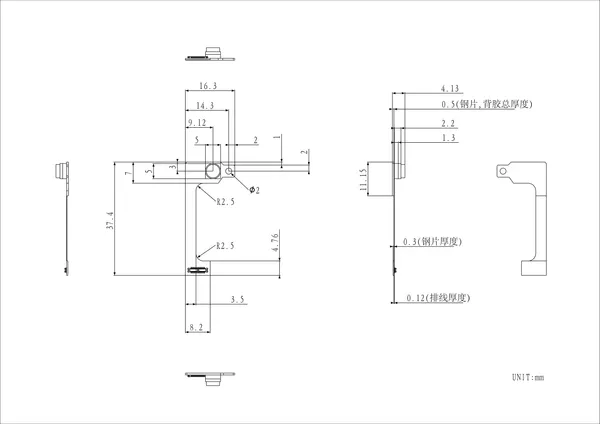
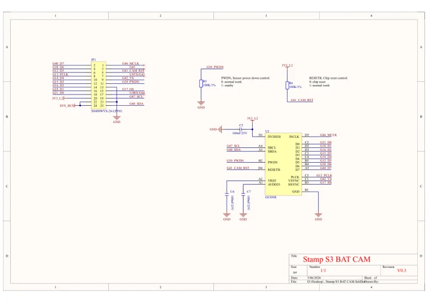

# Stamp-AddOn Cam0308

**M5Stack** · Expansion

Revision: Not identified

Coverage: Manufacturer references reviewed by scope; independent electrical and all-connector review pending

[Browse all manufacturers](../../../../BROWSE.md) · [Devices & IoT](../../../../DEVICES.md) · [Open in the browser guide](https://valleytech-black-wire-guide.pages.dev/?board=m5stack-expansion-stamp-addon-cam0308)

## Datasheets and original documentation

Board datasheet: **not yet recorded**. Visual reference: **available**.

[Manufacturer hardware documentation](https://docs.m5stack.com/en/stamp/Stamp-AddOn_Cam0308)

- **schematic / board**: [Stamp-AddOn Cam0308 Schematic PDF](https://m5stack-doc.oss-cn-shenzhen.aliyuncs.com/1256/SCH_A178_Stamp-AddOn_Cam0308_CAM_SCH_PDF_20260506_2026_06_09_09_31_04.pdf) · [saved document](../../../../library/media/e89b58dd724eff5c319c00085add8714ed4fb35319ed4c2ee9ee51975218eb87.pdf)
- **hardware-guide / board**: [Manufacturer pin and hardware documentation](https://docs.m5stack.com/en/stamp/Stamp-AddOn_Cam0308) · online

A chip datasheet, schematic and board datasheet have different scopes. Match the exact hardware revision.

[Documentation coverage and remaining gaps](../../../../DOCUMENTATION.md)

## Pinout

**pinout image** · Reviewed source · JPG

[Open original reference](../../../../library/media/2bcadb6f753a6e980a83ae5da55a4a2807d09d2052fb83a003db8fd1633cfe93.jpg)

**Credit and rights:** Not established; source attribution retained. Source/manufacturer: M5Stack.

[Source 1](https://m5stack-doc.oss-cn-shenzhen.aliyuncs.com/1256/A178_Stamp-AddOn_Cam0308_pinmap.jpg) · [Source 2](https://docs.m5stack.com/en/stamp/Stamp-AddOn_Cam0308)

Imported from existing M5Stack Board Reference; original working path preserved. Only the named connector or subsection is covered.

Image revision: Not identified

SHA-256: `2bcadb6f753a6e980a83ae5da55a4a2807d09d2052fb83a003db8fd1633cfe93`

## Dimensions

**source reference** · Unreviewed source · PNG

[Open original reference](../../../../library/media/7c3777e7d42d664539e0cc2f47192a04668d4e54b4c1eea247319f25fc81b80d.png)

**Credit and rights:** Source rights not yet established. Source/manufacturer: M5Stack.

[Source 1](https://m5stack-doc.oss-cn-shenzhen.aliyuncs.com/1256/A178_Stamp-AddOn_Cam0308_model_size_page_01.png) · [Source 2](https://docs.m5stack.com/en/stamp/Stamp-AddOn_Cam0308)

Original source index: Dimensions. This file is searchable but has not been promoted to a reviewed physical board pinout.

Image revision: Not identified

SHA-256: `7c3777e7d42d664539e0cc2f47192a04668d4e54b4c1eea247319f25fc81b80d`

## Stamp-AddOn Cam0308 Schematic PDF

**original reference PDF** · Manufacturer source and first-page preview inspected; electrical correctness and all-connector completeness not independently approved. · PDF

[Open original reference](../../../../library/media/e89b58dd724eff5c319c00085add8714ed4fb35319ed4c2ee9ee51975218eb87.pdf)

**Credit and rights:** Manufacturer artwork; reuse and print rights not established. Inclusion does not relicense the original.. Source/manufacturer: M5Stack.

[Source 1](https://m5stack-doc.oss-cn-shenzhen.aliyuncs.com/1256/SCH_A178_Stamp-AddOn_Cam0308_CAM_SCH_PDF_20260506_2026_06_09_09_31_04.pdf) · [Source 2](https://docs.m5stack.com/en/stamp/Stamp-AddOn_Cam0308)

Manufacturer source retained unchanged. Manufacturer source and first-page preview inspected; electrical correctness and all-connector completeness not independently approved.

Image revision: As supplied in the original; match exact board revision

SHA-256: `e89b58dd724eff5c319c00085add8714ed4fb35319ed4c2ee9ee51975218eb87`

Pin assignments have not been independently electrically verified. Check board revision before wiring.
